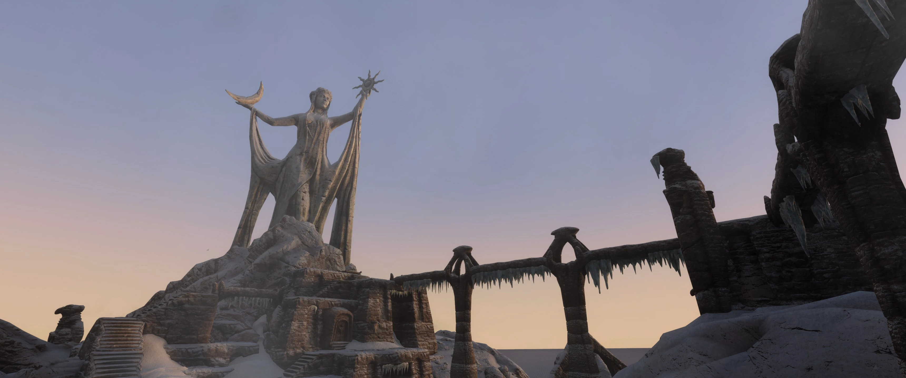
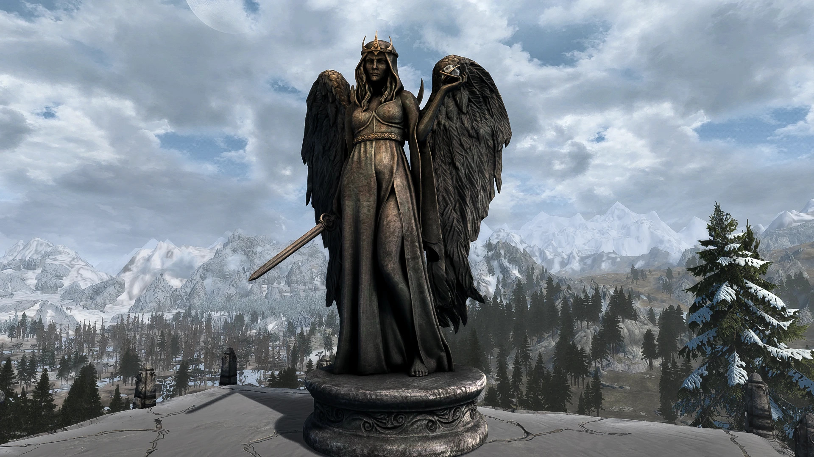
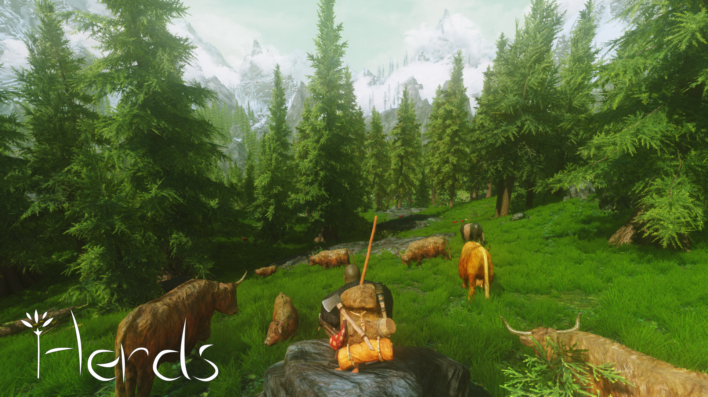
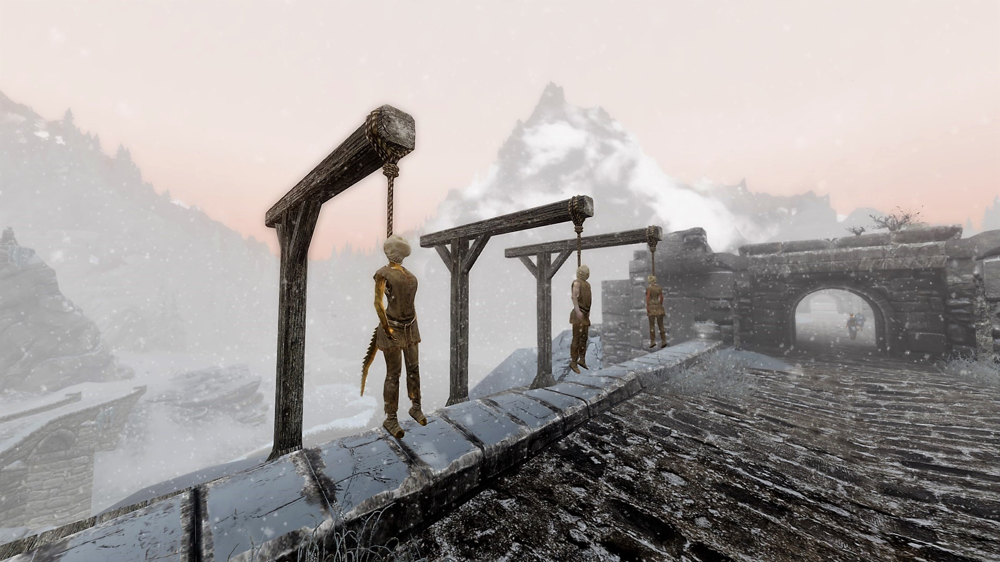
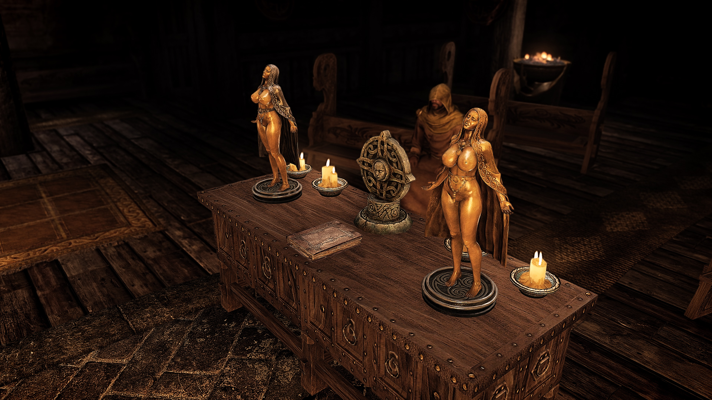

# skyrim_resurrected (WIP)
My modlist compilation for Skyrim AE, thanks to all the authors! I plan on doing a collection on nexusmods with this modlist. Feel free to use the "Adult (NSFW)" section or not, please.

# Essential (many mods need these)

| Mod | Spanish translation |
|----------|----------|
| [Skyrim Script Extender (SKSE64).](https://www.nexusmods.com/skyrimspecialedition/mods/30379) (be sure to check if you install the version for [Steam](https://store.steampowered.com/sub/626153/) or for [GOG](https://www.gog.com/en/game/the_elder_scrolls_v_skyrim_anniversary_edition)!). | Not needed. |
| [Address Library for SKSE Plugins.](https://www.nexusmods.com/skyrimspecialedition/mods/32444?tab=files) (be sure to pick Anniversary Edition AE or Special Edition SE!) | Not needed. |
| [Unofficial Skyrim Special Edition Patch - USSEP.](https://www.nexusmods.com/skyrimspecialedition/mods/266) | [USSEP Spanish con Voces](https://www.nexusmods.com/skyrimspecialedition/mods/5334?tab=files) (actualizado 6 julio 2023). |
| [Alternate Start - Live Another Life - SSE.](https://www.nexusmods.com/skyrimspecialedition/mods/272) | aaaa |
| [Base Object Swapper.](https://www.nexusmods.com/skyrimspecialedition/mods/60805) | aaa |
  
# Hunting

| Mod | Spanish translation |
|----------|----------|
| [Hawk Patch - Base Object Swapper Remake.](https://www.nexusmods.com/skyrimspecialedition/mods/71546?tab=description) (Makes all hawks that can't be shot shootable). | Not needed. |
| b | c |

# Shrines and statues
  - [Ryn's Azura's Shrine.](https://www.nexusmods.com/skyrimspecialedition/mods/86592) (A large overhaul of the Azura's Shrine area and a new dungeon).

  - [Daedric Shrines - All in One.](https://www.nexusmods.com/skyrimspecialedition/mods/78772)

# Towers and Ruins
  - [Ryn's Broken Tower Redoubt](https://www.nexusmods.com/skyrimspecialedition/mods/102141)
  - [Nordic Ruins of Skyrim SSE.](https://www.nexusmods.com/skyrimspecialedition/mods/20382)
  - [Tactical Valtheim.](https://www.nexusmods.com/skyrimspecialedition/mods/9101)

# Animals
  - [Herds SSE.](https://www.nexusmods.com/skyrimspecialedition/mods/13880)

# GUI
  - [SkyUI.](https://www.nexusmods.com/skyrimspecialedition/mods/12604?tab=files)

# Fixes
  - [SSE Engine Fixes (skse64 plugin).](https://www.nexusmods.com/skyrimspecialedition/mods/17230)
  - [Bug Fixes SSE.](https://www.nexusmods.com/skyrimspecialedition/mods/33261)
  - [SSE FPS Stabilizer.](https://www.nexusmods.com/skyrimspecialedition/mods/38438)

# Animations
  - [Dynamic Animation Replacer (DAR).](https://www.nexusmods.com/skyrimspecialedition/mods/33746)
  - [EVG Conditional Idles (DAR).](https://www.nexusmods.com/skyrimspecialedition/mods/34006)
  - [Male Player Animations (DAR).](https://www.nexusmods.com/skyrimspecialedition/mods/89225)
  - [Female Player Animations (DAR).](https://www.nexusmods.com/skyrimspecialedition/mods/85073)
  - [Gesture Animation Remix (DAR).](https://www.nexusmods.com/skyrimspecialedition/mods/64420)
  - [Conditional tavern cheering (DAR).](https://www.nexusmods.com/skyrimspecialedition/mods/63029)
  - [Dynamic Swimming (DAR).](https://www.nexusmods.com/skyrimspecialedition/mods/34853?tab=description)
  - [Lively Children Animations (DAR).](https://www.nexusmods.com/skyrimspecialedition/mods/67557)

# Immersion
  - [Flying Crows SSE.](https://www.nexusmods.com/skyrimspecialedition/mods/49270)
  - [Nocturnal Moths.](https://www.nexusmods.com/skyrimspecialedition/mods/68288)
  - [Footprints.](https://www.nexusmods.com/skyrimspecialedition/mods/3808)
  - [Extended Encounters.](https://www.nexusmods.com/skyrimspecialedition/mods/44810)

# Meshes/Models
  - [Night Mother.](https://www.nexusmods.com/skyrimspecialedition/mods/83527)
  - [Falmer Overhaul - New models and textures.](https://www.nexusmods.com/skyrimspecialedition/mods/86338)
  - [JS Shrines of the Divines SE.](https://www.nexusmods.com/skyrimspecialedition/mods/33394)
  - [Additional Dremora faces.](https://www.nexusmods.com/skyrimspecialedition/mods/97946)

# Weather
  - [Volumetric Mists.](https://www.nexusmods.com/skyrimspecialedition/mods/29273)
  - [Obsidian Weathers and Seasons.](https://www.nexusmods.com/skyrimspecialedition/mods/12125)

# Towns and Cities
  - [Fortified Whiterun.](https://www.nexusmods.com/skyrimspecialedition/mods/40094)

# Grim and Gore
  - [Gallows of Skyrim SSE.](https://www.nexusmods.com/skyrimspecialedition/mods/26542)

  - 
  - [Skyrim Battle Aftermath SE.](https://www.nexusmods.com/skyrimspecialedition/mods/4742)

# Creatures  
  - [Grandiose Giants.](https://www.nexusmods.com/skyrimspecialedition/mods/23889)

# Sea and Water
  - [Depths of Skyrim - An Underwater Overhaul SSE.](https://www.nexusmods.com/skyrimspecialedition/mods/26913)

# Dungeons
  - [Dungeons - Revisited](https://www.nexusmods.com/skyrimspecialedition/mods/51798)

# Adult (NSFW)
  - [PsBoss's Statuettes](https://www.nexusmods.com/skyrimspecialedition/mods/66550)

  - [Caliente's Beautiful Bodies Enhancer -CBBE-](https://www.nexusmods.com/skyrimspecialedition/mods/198)
  - 

# Misc
  - [Achievements Mods Enabler SE-AE.](https://www.nexusmods.com/skyrimspecialedition/mods/245)

# Spanish translations (if you want to play it with spanish texts & voices):
  - [Gallows of Skyrim SSE - Spanish Translation.](https://www.nexusmods.com/skyrimspecialedition/mods/37513)
  - [Skyrim Battle Aftermath SE - Spanish Translation.](https://www.nexusmods.com/skyrimspecialedition/mods/50628)
  - [Ryn's Azura's Shrine - Spanish Translation.](https://www.nexusmods.com/skyrimspecialedition/mods/88621)
  - [Herds SSE Spanish.](https://www.nexusmods.com/skyrimspecialedition/mods/13980)
  - [Unofficial Skyrim Special Edition Patch - Castellano con voces - Spanish.](https://www.nexusmods.com/skyrimspecialedition/mods/73323)
  - [Tactical Valtheim SSE - Spanish Translation.](https://www.nexusmods.com/skyrimspecialedition/mods/42326)
