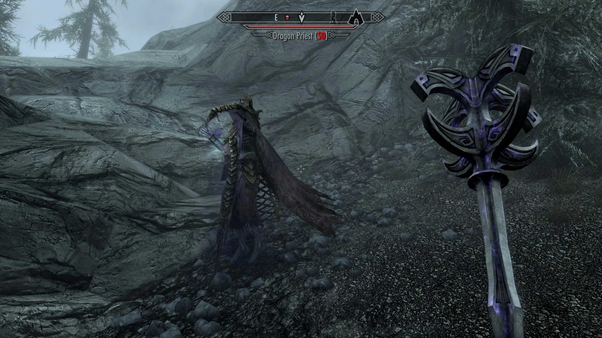
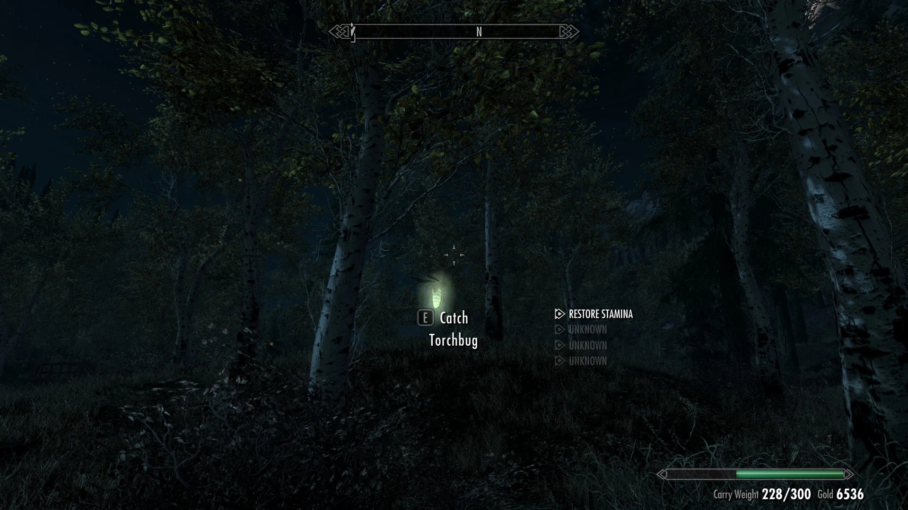

# Skyrim Resurrected 2023 modlist by Jaume Alcazo (WIP)

My modlist compilation for Skyrim AE, thanks to all the authors! I plan on doing a [collection](https://next.nexusmods.com/) on [Nexusmods](https://www.nexusmods.com/skyrimspecialedition) with this modlist. Feel free to use the "Adult (NSFW)" section or not, please. Contact me at jaume.alcazo@gmail.com


# Essential (many mods need these)

| Mod | Spanish translation |
|----------|----------|
| Skyrim Script Extender (SKSE64). (be sure to check if you install the version for [Steam](https://store.steampowered.com/sub/626153/) or for [GOG](https://www.gog.com/en/game/the_elder_scrolls_v_skyrim_anniversary_edition)!). | Para evitar que SKSE64 de Vortex Nexusmods **CAMBIE EL IDIOMA A ENGLISH** hay que primero [instalarlo de Vortex](https://www.nexusmods.com/skyrimspecialedition/mods/30379?tab=files) y luego bajarlo e instalarlo manualmente de [AQUÍ](https://skse.silverlock.org/) (comprobado 10/11/23). |
| [Address Library for SKSE Plugins.](https://www.nexusmods.com/skyrimspecialedition/mods/32444?tab=files) (be sure to pick Anniversary Edition AE or Special Edition SE!) | Not needed. |
| [Unofficial Skyrim Special Edition Patch - USSEP.](https://www.nexusmods.com/skyrimspecialedition/mods/266) | [USSEP Spanish con Voces](https://www.nexusmods.com/skyrimspecialedition/mods/5334?tab=files) (actualizado 6 julio 2023). |
| [Alternate Start - Live Another Life - SSE.](https://www.nexusmods.com/skyrimspecialedition/mods/272) | [Alternate Start - Live Another Life - Castellano con voces - Spanish](https://www.nexusmods.com/skyrimspecialedition/mods/65264?tab=files) (actualizado 24 junio 2023). |
| [Base Object Swapper.](https://www.nexusmods.com/skyrimspecialedition/mods/60805) (needs [powerofthree's Tweaks](https://www.nexusmods.com/skyrimspecialedition/mods/51073)). | Not needed. |
| [Spell Perk Item Distributor (SPID).](https://www.nexusmods.com/skyrimspecialedition/mods/36869) | Not needed. |
| [CBBE Body.](https://www.nexusmods.com/skyrimspecialedition/mods/198) | [CBBE - Castellano - Spanish](https://www.nexusmods.com/skyrimspecialedition/mods/64240?tab=files) (updated 14 aug 2023). |
| [Achievements Mods Enabler.](https://www.nexusmods.com/skyrimspecialedition/mods/245) (Enables achievements in Skyrim SE/AE with mods. SKSE64 support). | Not needed. Furthermore: You don't need his DLL loader if you are using SKSE64 (which you should!). |
| [powerofthree's Papyrus Extender.](https://www.nexusmods.com/skyrimspecialedition/mods/22854) (SKSE64 plugin that extends Papyrus script functionality, with over 275 new Papyrus functions, and 29 events). | Not needed. |
| [SSE Engine Fixes (skse64 plugin).](https://www.nexusmods.com/skyrimspecialedition/mods/17230) (part 1 by vortex, part 2 MANUAL INSTALLATION) | Not needed. Remember that part2: "Download this and extract it to your main Skyrim folder manually; it cannot be installed with a mod manager. This is required or the SKSE64 plugin won't load.". In my experience, SSE Engine Fixes fixed an error with the races description in one of my modded modlists. |

# GUI

| Mod | Spanish translation |
|----------|----------|
| [SkyUI.](https://www.nexusmods.com/skyrimspecialedition/mods/12604) | [SkyUI - Spanish.](https://www.nexusmods.com/skyrimspecialedition/mods/95983?tab=files) |
| [moreHUD SE.](https://www.nexusmods.com/skyrimspecialedition/mods/12688) | [moreHUD - Castellano - Spanish.](https://www.nexusmods.com/skyrimspecialedition/mods/80137?tab=files) |

<details><summary>Screenshots moreHUD. </summary>    </details>

# Meshes

| Mod | Spanish translation |
|----------|----------|
| [Dwemer Pipework Reworked](https://www.nexusmods.com/skyrimspecialedition/mods/46507?tab=files) | Not needed. |
| [Thrones of Skyrim.](https://www.nexusmods.com/skyrimspecialedition/mods/41198) | Not needed. |
| [Better Blended Mushrooms.](https://www.nexusmods.com/skyrimspecialedition/mods/67725) | Not needed. |

<details><summary>Screenshots examples of the meshes </summary>     </details>

# Religion

| Mod | Spanish translation |
|----------|----------|
| [Wintersun - Faiths of Skyrim.](https://www.nexusmods.com/skyrimspecialedition/mods/22506) | [Wintersun - Faiths of Skyrim Spanish.](https://www.nexusmods.com/skyrimspecialedition/mods/22563?tab=files) |

:tv: [Video review of Wintersun.](https://www.youtube.com/watch?v=g8G7jAr9mY8)

# Monsters

| Mod | Spanish translation |
|----------|----------|
| [Bogmort - Mud Monsters of Morthal Swamp.](https://www.nexusmods.com/skyrimspecialedition/mods/22447) | [Bogmort - Mud Monsters of Morthal Swamp - Spanish Translation.](https://www.nexusmods.com/skyrimspecialedition/mods/70060) |
| [Giants Overhaul- Mihail Monsters and Animals (SE-AE version).](https://www.nexusmods.com/skyrimspecialedition/mods/98581) | ``` TO BE DONE 🚧 ``` |
| [Sea Giants and Ice Titans- Mihail Monsters and Animals (SE-AE version).](https://www.nexusmods.com/skyrimspecialedition/mods/103285) | ``` TO BE DONE 🚧 ``` |

<details><summary>Screenshots (Bogmort). </summary>   </details>

# Horses

| Mod | Spanish translation |
|----------|----------|
| [Blaze Of Eventide.](https://www.nexusmods.com/skyrimspecialedition/mods/3178/) (unique horse). | ``` TO BE DONE 🚧 ``` |
| [Zim's Aenbyr Custom Horse.](https://www.nexusmods.com/skyrimspecialedition/mods/76722) (unique horse). | ``` TO BE DONE 🚧 ``` |
| [Aeonbarr - a Unique and Summonable Horse (CH-Friendly) For SE.](https://www.nexusmods.com/skyrimspecialedition/mods/38466) (unique horse). | ``` TO BE DONE 🚧 ``` |
| [Witcher Horse Expansion.](https://www.nexusmods.com/skyrimspecialedition/mods/72490) | ``` TO BE DONE 🚧 ``` |

<details><summary>Screenshots. </summary>      </details>

# NPC's

| Mod | Spanish translation |
|----------|----------|
| [Pandorable's NPCs (FEMALES, USSEP).](https://www.nexusmods.com/skyrimspecialedition/mods/19012) (A visual overhaul of 85 female NPCs). | [Pandorable's NPCs - Spanish Translation (FEMALES, USSEP).](https://www.nexusmods.com/skyrimspecialedition/mods/101061) |

<details><summary>Screenshots example (here you have Zaria and Aduri Sarethi). </summary>  </details>

| Mod | Spanish translation |
|----------|----------|
| [Pandorable's NPCs - males.](https://www.nexusmods.com/skyrimspecialedition/mods/42043) | FALTA |
| [Pandorable's NPCs - males 2.](https://www.nexusmods.com/skyrimspecialedition/mods/50617) (Another 60 lads). | [Pandorable's NPCs - males 2 - Spanish Translation.](https://www.nexusmods.com/skyrimspecialedition/mods/101485) |
| [Pandorable's NPCs - Dawnguard (USSEP).](https://www.nexusmods.com/skyrimspecialedition/mods/24135?tab=files) | [Pandorable's NPCs - Dawnguard - Spanish Translation (USSEP).](https://www.nexusmods.com/skyrimspecialedition/mods/101056?tab=files) | 
| [Dibella's Blessing.](https://www.nexusmods.com/skyrimspecialedition/mods/82606) (Apparance overhaul for 233 female characters from Skyrim). | [Dibella's Blessing - Spanish Translation.](https://www.nexusmods.com/skyrimspecialedition/mods/83704?tab=files) |

<details><summary>Screenshots example for Dibella's Blessing (here you have Bothela, Eola, Hroki, Marise, Karliah and Voldsea) </summary>    </details>


| [RS Children Overhaul.](https://www.nexusmods.com/skyrimspecialedition/mods/2650?tab=files) | Spanish translation marked redundant by Vortex. |

# Items

| Mod | Spanish translation |
|----------|----------|
| [The Elder Scrolls Online Imports.](https://www.nexusmods.com/skyrimspecialedition/mods/11729) | ``` TO BE DONE 🚧 ``` |

# Hunting

| Mod | Spanish translation |
|----------|----------|
| [Immersive Death Cycle (ESL flagged).](https://www.nexusmods.com/skyrimspecialedition/mods/97048) (See dead animals decay over time, eventually turning into bones. Super lite and without any vanilla edits, needs SPID essential mod, already installed before in this modlist). | [Immersive Death Cycle - Castellano - Spanish](https://www.nexusmods.com/skyrimspecialedition/mods/97175) |
| [Hawk Patch - Base Object Swapper Remake.](https://www.nexusmods.com/skyrimspecialedition/mods/71546?tab=description) (Makes all hawks that can't be shot shootable). | Not needed. |
| [Hunting in Skyrim - A Hunting Guild SE](https://www.nexusmods.com/skyrimspecialedition/mods/10353) (adds a Hunting Guild, overhauls hunting experience, realistic animal skinning (like Red Dead Redemption), animal trapping, kill & stat tracking, new skills and abilities, new NPCs and locations, new dungeons, new weapons, etc.) | ``` TO BE DONE 🚧 ``` |

# Expansions / DLC sized expansions

| Mod | Spanish translation |
|----------|----------|
| [Beyond Skyrim - Bruma SE](https://www.nexusmods.com/skyrimspecialedition/mods/10917) | [Beyond Skyrim Bruma SPANISH (by Jaume y Rubenoky).](https://www.nexusmods.com/skyrimspecialedition/mods/14508?tab=files) |

# Flora

| Mod | Spanish translation |
|----------|----------|
| [Folkvangr - Grass and Landscape Overhaul.](https://www.nexusmods.com/skyrimspecialedition/mods/44899) | Not needed. |

<details><summary>Screenshots example for Folkvangr </summary>     </details>

# Animations (OAR replaces DAR and it's fully compatible with DAR animations)

| Mod | Spanish translation |
|----------|----------|
| [Open Animation Replacer (OAR).](https://www.nexusmods.com/skyrimspecialedition/mods/92109) (Full backwards compatibility with DAR). | Not needed. |
| [Animation Queue Fix.](https://www.nexusmods.com/skyrimspecialedition/mods/82395) (required by OAR). | Not needed. |
| [Paired Animation Improvements.](https://www.nexusmods.com/skyrimspecialedition/mods/99621) | Not needed. |
| [EVG Conditional Idles (DAR).](https://www.nexusmods.com/skyrimspecialedition/mods/34006) | [EVG Conditional Idles - Spanish.](https://www.nexusmods.com/skyrimspecialedition/mods/66859) |
| [Male Player Animations (DAR).](https://www.nexusmods.com/skyrimspecialedition/mods/89225) | Not needed. |
| [Female Player Animations (DAR).](https://www.nexusmods.com/skyrimspecialedition/mods/85073) | Not needed. |
| [Gesture Animation Remix (DAR).](https://www.nexusmods.com/skyrimspecialedition/mods/64420) | Not needed. ("Adds over 50 dialogue gesture animation variants according to NPCs personality, role in society and by armor type. Works with custom followers and NPC from mods as well as vanilla"). |
| [Conditional tavern cheering (DAR).](https://www.nexusmods.com/skyrimspecialedition/mods/63029) | Not needed. |
| [Dynamic Swimming (DAR).](https://www.nexusmods.com/skyrimspecialedition/mods/34853?tab=description) | Not needed. |
| [Lively Children Animations (DAR).](https://www.nexusmods.com/skyrimspecialedition/mods/67557) | Not needed. |

:tv: [Video review of EVG Conditional Idles](https://www.youtube.com/watch?v=XgtfmLYdNOk)

 ``` FINS AQUÍ 53 MODS, 9/11/23 🚧 ```

# Shrines and statues
  - [Ryn's Azura's Shrine.](https://www.nexusmods.com/skyrimspecialedition/mods/86592) (A large overhaul of the Azura's Shrine area and a new dungeon).


  - [Daedric Shrines - All in One.](https://www.nexusmods.com/skyrimspecialedition/mods/78772)


# Towers and Ruins
  - [Ryn's Broken Tower Redoubt](https://www.nexusmods.com/skyrimspecialedition/mods/102141)
  - [Nordic Ruins of Skyrim SSE.](https://www.nexusmods.com/skyrimspecialedition/mods/20382)
  - [Tactical Valtheim.](https://www.nexusmods.com/skyrimspecialedition/mods/9101)

# Animals
  - [Herds SSE.](https://www.nexusmods.com/skyrimspecialedition/mods/13880)


# GUI
  - [SkyUI.](https://www.nexusmods.com/skyrimspecialedition/mods/12604?tab=files)

# Fixes
  - [SSE Engine Fixes (skse64 plugin).](https://www.nexusmods.com/skyrimspecialedition/mods/17230)
  - [Bug Fixes SSE.](https://www.nexusmods.com/skyrimspecialedition/mods/33261)
  - [SSE FPS Stabilizer.](https://www.nexusmods.com/skyrimspecialedition/mods/38438)

# Immersion
  - [Flying Crows SSE.](https://www.nexusmods.com/skyrimspecialedition/mods/49270)
  - [Nocturnal Moths.](https://www.nexusmods.com/skyrimspecialedition/mods/68288)
  - [Footprints.](https://www.nexusmods.com/skyrimspecialedition/mods/3808)
  - [Extended Encounters.](https://www.nexusmods.com/skyrimspecialedition/mods/44810)

# Meshes/Models
  - [Night Mother.](https://www.nexusmods.com/skyrimspecialedition/mods/83527)
  - [Falmer Overhaul - New models and textures.](https://www.nexusmods.com/skyrimspecialedition/mods/86338)
  - [JS Shrines of the Divines SE.](https://www.nexusmods.com/skyrimspecialedition/mods/33394)
  - [Additional Dremora faces.](https://www.nexusmods.com/skyrimspecialedition/mods/97946)

# Weather
  - [Volumetric Mists.](https://www.nexusmods.com/skyrimspecialedition/mods/29273)
  - [Obsidian Weathers and Seasons.](https://www.nexusmods.com/skyrimspecialedition/mods/12125)

# Towns and Cities
  - [Fortified Whiterun.](https://www.nexusmods.com/skyrimspecialedition/mods/40094)

# Grim and Gore
  - [Gallows of Skyrim SSE.](https://www.nexusmods.com/skyrimspecialedition/mods/26542)

  - 
  - [Skyrim Battle Aftermath SE.](https://www.nexusmods.com/skyrimspecialedition/mods/4742)

# Sea and Water
  - [Depths of Skyrim - An Underwater Overhaul SSE.](https://www.nexusmods.com/skyrimspecialedition/mods/26913)

# Dungeons
  - [Dungeons - Revisited](https://www.nexusmods.com/skyrimspecialedition/mods/51798)

# Adult (NSFW)
  - [PsBoss's Statuettes](https://www.nexusmods.com/skyrimspecialedition/mods/66550)

  - [Caliente's Beautiful Bodies Enhancer -CBBE-](https://www.nexusmods.com/skyrimspecialedition/mods/198)
  - 

# Misc
  - [Achievements Mods Enabler SE-AE.](https://www.nexusmods.com/skyrimspecialedition/mods/245)

# Spanish translations (if you want to play it with spanish texts & voices):
  - [Gallows of Skyrim SSE - Spanish Translation.](https://www.nexusmods.com/skyrimspecialedition/mods/37513)
  - [Skyrim Battle Aftermath SE - Spanish Translation.](https://www.nexusmods.com/skyrimspecialedition/mods/50628)
  - [Ryn's Azura's Shrine - Spanish Translation.](https://www.nexusmods.com/skyrimspecialedition/mods/88621)
  - [Herds SSE Spanish.](https://www.nexusmods.com/skyrimspecialedition/mods/13980)
  - [Unofficial Skyrim Special Edition Patch - Castellano con voces - Spanish.](https://www.nexusmods.com/skyrimspecialedition/mods/73323)
  - [Tactical Valtheim SSE - Spanish Translation.](https://www.nexusmods.com/skyrimspecialedition/mods/42326)
