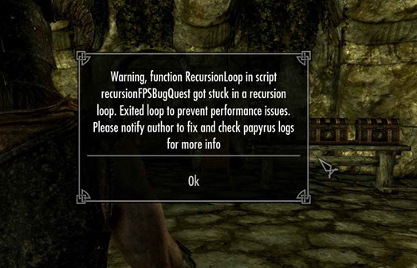
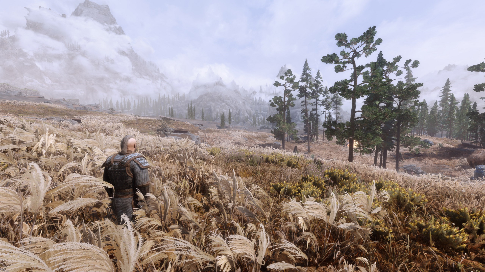

# Skyrim Resurrected 2023 modlist by Jaume Alcazo (WIP)

My modlist compilation for Skyrim AE, thanks to all the authors! I plan on doing a [collection](https://next.nexusmods.com/) on [Nexusmods](https://www.nexusmods.com/skyrimspecialedition) with this modlist. Feel free to use the "Adult (NSFW)" section or not, please. Contact me at jaume.alcazo@gmail.com


# Essential (many mods need these)

| Number | Mod | Brief explanation | Spanish translation |
|----------|----------|----------|----------|
| 1 | Skyrim Script Extender (SKSE64). (be sure to check if you install the version for [Steam](https://store.steampowered.com/sub/626153/) or for [GOG](https://www.gog.com/en/game/the_elder_scrolls_v_skyrim_anniversary_edition)!). | Essential. A lot of good mods use this as a base. | Para evitar que SKSE64 de Vortex Nexusmods **CAMBIE EL IDIOMA A ENGLISH** hay que primero [instalarlo de Vortex](https://www.nexusmods.com/skyrimspecialedition/mods/30379?tab=files) y luego bajarlo e instalarlo manualmente de [AQUÍ](https://skse.silverlock.org/) (comprobado 10/11/23). |
| 2 | [Address Library for SKSE Plugins.](https://www.nexusmods.com/skyrimspecialedition/mods/32444) | Be sure to pick Anniversary Edition AE or Special Edition SE! | Not needed. |
|3 | [Unofficial Skyrim Special Edition Patch - USSEP.](https://www.nexusmods.com/skyrimspecialedition/mods/266) | Corrects a lot of bugs. | [USSEP Spanish con Voces](https://www.nexusmods.com/skyrimspecialedition/mods/5334?tab=files) (actualizado 6 julio 2023). |
| 4 | [Alternate Start - Live Another Life - SSE.](https://www.nexusmods.com/skyrimspecialedition/mods/272) | Alternative starts, skip the standard vanilla or do it, as you wish. | [Alternate Start - Live Another Life - Castellano con voces - Spanish](https://www.nexusmods.com/skyrimspecialedition/mods/65264?tab=files) (actualizado 24 junio 2023). |
| 5 | [Spell Perk Item Distributor (SPID).](https://www.nexusmods.com/skyrimspecialedition/mods/36869) | SKSE plugin that is used add spells/perks/items/shouts, etc. to the NPCs. | Not needed. |
| 6 | [CBBE Body.](https://www.nexusmods.com/skyrimspecialedition/mods/198) | Nice body, UNP alternative gives nudes when looting females (not males), and it's kinda un-inmersive if you are doing a SFW playthrough. | [CBBE - Castellano - Spanish](https://www.nexusmods.com/skyrimspecialedition/mods/64240?tab=files) (updated 14 aug 2023). |
| 7 | CBBE AE-CC Outfits. (same page as CBBE Body) | Includes all outfits of the Anniversary Edition/Creation Club using the "CBBE Curvy (Outfit)" preset and BodySlide files. No body physics as almost all outfits part of it shouldn't have it anyway. Use BodySlide to apply other body presets yourself. | Not needed. |
| 8 | [Achievements Mods Enabler.](https://www.nexusmods.com/skyrimspecialedition/mods/245) (Enables achievements in Skyrim SE/AE with mods. SKSE64 support). | Obviously we want our Steam achievements back!<br>  | Not needed. Furthermore: You don't need his DLL loader if you are using SKSE64 (which you should!). |
| 9 | [powerofthree's Papyrus Extender.](https://www.nexusmods.com/skyrimspecialedition/mods/22854) | SKSE64 plugin that extends Papyrus script functionality, with over 275 new Papyrus functions, and 29 events. | Not needed. |
| 10 | [Inventory Functions SE-AE.](https://www.nexusmods.com/skyrimspecialedition/mods/13366) | Allow mods filtering the inventory by keyword. | Not needed. |
| 11 | [Keyword Item Distributor (KID).](https://www.nexusmods.com/skyrimspecialedition/mods/55728) | Distributes keywords to different objects.  | Not needed. |
| 12 | [MergeMapper.](https://www.nexusmods.com/skyrimspecialedition/mods/74689) | Allows Papyrus scripts to be aware and also allows other DLLs to support zmerge merges.  | Not needed. |
| 13 | [Inventory Interface Information Injector.](https://www.nexusmods.com/skyrimspecialedition/mods/85702) | Inserts interesting information, including item icons, into the inventory interface. | [Inventory Interface Information Injector - Castellano - Spanish.](https://www.nexusmods.com/skyrimspecialedition/mods/94916) |
| 14 | [PapyrusUtil SE - Modders Scripting Utility Functions.](https://www.nexusmods.com/skyrimspecialedition/mods/13048) | Adds several new scripts with native functions that provide various conveniences related to data storage and other misc functions to the scripter/modder.  | Not needed. |
| Total in this category: | 14 mods | | |

# Fixes/helpers

| Number | Mod | Brief explanation | Spanish translation |
|----------|----------|----------|----------|
| 1 | [Face Discoloration Fix.](https://www.nexusmods.com/skyrimspecialedition/mods/42441) | Eliminates the dreaded "dark face" issue that occurs when the game encounters FaceGen errors. | Not needed. |
| 2 | [Actor Limit Fix.](https://www.nexusmods.com/skyrimspecialedition/mods/32349) | Increases the number of actors that can move, make facial expressions, and have their lips synced to their voice lines at any given time. | Not needed. |
| 3 | [Scrambled Bugs.](https://www.nexusmods.com/skyrimspecialedition/mods/43532) | A collection of engine bug fixes and patches. | Not needed. |
| 4 | [MCM Helper](https://www.nexusmods.com/skyrimspecialedition/mods/53000) | Simplifies the creation of Mod Configuration Menus. | Not needed. |
| 5 | [Mfg Fix.](https://www.nexusmods.com/skyrimspecialedition/mods/11669) | Fixes the "mfg" console command and adds some more fixes. | Not needed. |
| 6 | [SSE Engine Fixes (skse64 plugin).](https://www.nexusmods.com/skyrimspecialedition/mods/17230) (part 1 by vortex, part 2 MANUAL INSTALLATION) | Fixes various Skyrim SE (and AE) engine issues. Remember that part 2: **"Download this and extract it to your main Skyrim folder manually; it cannot be installed with a mod manager.** This is required or the SKSE64 plugin won't load.". | Not needed. In my experience, SSE Engine Fixes fixed an error with the race description in one of my modded modlists. |
| 7 | [Aurora Fix.](https://www.nexusmods.com/skyrimspecialedition/mods/77834) | SKSE plugin which fixes auroras getting stuck when transitioning between world spaces. | Not needed. |
| 8 | [WIDeadBodyCleanupScript Crash Fix.](https://www.nexusmods.com/skyrimspecialedition/mods/62413) | Fixes a rare crash when saving due to wideadbodycleanupscript. | Not needed. |
| 9 | [CritterSpawn Congestion Fix.](https://www.nexusmods.com/skyrimspecialedition/mods/67276) | A fix for the bug spawner, clogging your script engine, causing stacks to be dumped and bugs to be spawned. | Not needed. |
| 10 | [NPC AI Process Position Fix - NG.](https://www.nexusmods.com/skyrimspecialedition/mods/69326) | Skyrim's engine has a limitation where it can only update an NPC’s AI process position for one hour at most if that NPC is loaded in currently loaded cells (a high AI Process one). | Not needed. |
| 11 | [High Gate Ruins Puzzle Reset Fix.](https://www.nexusmods.com/skyrimspecialedition/mods/53643) | Fixes High Gate Ruins puzzle not resetting properly, blocking off half the dungeon on subsequent visits. | Not needed. |
| 12 | [Papyrus Tweaks NG](https://www.nexusmods.com/skyrimspecialedition/mods/77779) | Collection of fixes, tweaks, and performance improvements for Skyrim's script engine. 100% configurable. Install/Uninstall anytime. | Not needed. |
| 13 | [UIExtensions.](https://www.nexusmods.com/skyrimspecialedition/mods/17561) | Adds various custom menus to Skyrim for modder use. | [UIExtensions - Castellano - Spanish.](https://www.nexusmods.com/skyrimspecialedition/mods/89636) |
| 14 | [Tavern AI fix](https://www.nexusmods.com/skyrimspecialedition/mods/23107) | Fixes a couple of things in the behavior of tavern workers. | [Tavern AI Fix - Spanish Castellano Español](https://www.nexusmods.com/skyrimspecialedition/mods/94086) |
| 15 | [SSE Display Tweaks.](https://www.nexusmods.com/skyrimspecialedition/mods/34705) | todo | todo |
| 16 | [SSE FPS Stabilizer.](https://www.nexusmods.com/skyrimspecialedition/mods/38438) | todo | todo |
| 17 | [Recursion Monitor (Recursion Fix).](https://www.nexusmods.com/skyrimspecialedition/mods/76867) | Detects broken papyrus scripts stuck in recursion and prevents huge framerate lag  | Not needed. |
| 18 | [Delete Hawk Nests.](https://www.nexusmods.com/skyrimspecialedition/mods/105994) | Deletes the floating hawk nests caused by forest mods by replacing the mesh. No world edits. | Not needed. |
| 19 | [Light Limit Fix. ](https://www.nexusmods.com/skyrimspecialedition/mods/99548) | [Requires Community Shaders.], [requires d3dcompiler](https://www.nexusmods.com/skyrimspecialedition/mods/31963) Unlimited dynamic light sources such as torches and magic lights.
Doubled the portal-strict light limit (7 to 15). Split meshes are no longer required. Contact shadows for all lights. Shadows for first-person torches and light spells. |
| 20 | [Community Shaders.](https://www.nexusmods.com/skyrimspecialedition/mods/86492) | Open-source SKSE core plugin for community-driven advanced graphics modifications for AE, SE and VR. Also fixes bugs. [Requires Auto Parallax.]([Auto Parallax](https://www.nexusmods.com/skyrimspecialedition/mods/79473)) | SKSE plugin which automatically disables parallax on meshes that have missing height textures or conflict with single-pass shaders. | Not needed. |
| 21 | [Auto Parallax.](https://www.nexusmods.com/skyrimspecialedition/mods/79473) | todo | Not needed. |
| 22 | [d3dcompiler.](https://www.nexusmods.com/skyrimspecialedition/mods/31963) | Injects fixed parallax shaders into Skyrim SE/AE. **MANUAL INSTALLATION** | Not needed. It's just a .dll in the folder of the game. |
| Total in this category: | 22 mods | | |

 

# Armor, armors

| Number | Mod |  Brief explanation | Spanish translation |
|----------|----------|----------|----------|
| 1 | [Yaldabaoth Armor.](https://www.nexusmods.com/skyrimspecialedition/mods/104528) | Cool new armor. | [Armadura y espada de Yaldabaoth el Demiurgo SPANISH by Jaume.](https://www.nexusmods.com/skyrimspecialedition/mods/104824) |
| 2 | [Weapons Armor Clothing and Clutter Fixes.](https://www.nexusmods.com/skyrimspecialedition/mods/18994) | Fixes bugs and inconsistencies for Skyrim's weapons, armor, clothing, jewelry, and clutter items. | [Weapons Armor Clothing and Clutter Fixes - Spanish Translation.](https://www.nexusmods.com/skyrimspecialedition/mods/37795) |
| 3 | [Sons of Skyrim.](https://www.nexusmods.com/skyrimspecialedition/mods/68656) | Replacer for guards of all cities. | [Sons of Skyrim - Spanish.](https://www.nexusmods.com/skyrimspecialedition/mods/86018) | 
| Total in this category: | 3 mods | | |

SONS OF SKYRIM FIXES NO! IT MESSES WITH THE SPANISH TRANSLATION OF THE MARKARTH GUARDS!!! JAUME 3/12/2023

<details><summary>Screenshots examples.</summary>             </details>

# Meshes

| Number | Mod |  Brief explanation | Spanish translation |
|----------|----------|----------|----------|
| 1 | [Dwemer Pipework Reworked](https://www.nexusmods.com/skyrimspecialedition/mods/46507) | See screenshots below. | Not needed. |
| 2 | [Thrones of Skyrim.](https://www.nexusmods.com/skyrimspecialedition/mods/41198) | See screenshots below. | Not needed. |
| 3 | [Renthal's waterwheel HD.](https://www.nexusmods.com/skyrimspecialedition/mods/26567) | See screenshots below. | Not needed. |
| 4 | [Night Mother.](https://www.nexusmods.com/skyrimspecialedition/mods/83527) | See screenshots below. | Not needed. |
| 5 | [JS Purses and Septims SE.](https://www.nexusmods.com/skyrimspecialedition/mods/37306) | See screenshots below. | [JS Purses and Septims SE - Latino.](https://www.nexusmods.com/skyrimspecialedition/mods/71667) | [ElSopa - Training Dummies Redone.](https://www.nexusmods.com/skyrimspecialedition/mods/102948) | todo | Not needed. |
| 6 | [JS Solitude Sewer Cover SE.](https://www.nexusmods.com/skyrimspecialedition/mods/104980) | A 3D remake of the Solitude Sewer Cover. Comes in 1k, 2k, and 4k (recommended) versions. No ESP. | Not needed. |
| 7 | [Additional Dremora faces.](https://www.nexusmods.com/skyrimspecialedition/mods/97946) | This mod adds new faces for Dremora, including female ones. | todo |
| 8 | [Sconces of Skyrim - Markarth Braziers Improved.](https://www.nexusmods.com/skyrimspecialedition/mods/67386) | Requires SMIM. | Not needed. |
| 9 | [SMIM - Static Mesh Improvement Mod.](https://www.nexusmods.com/skyrimspecialedition/mods/659) | Install the EVERYTHING version. | [Static Mesh Improvement Mod - Spanish Castellano Espanol.](https://www.nexusmods.com/skyrimspecialedition/mods/94137) (Uploaded 24 Jun 2023) |
| 10 | [Kanjs - Bird Nests and Eggs - up to 4k.](https://www.nexusmods.com/skyrimspecialedition/mods/64905) | Retexture and remesh of all bird nests and eggs. | Not needed. |
| 11 | [Glorious Doors of Skyrim (GDOS) SE.](https://www.nexusmods.com/skyrimspecialedition/mods/32376) | All-In-One pack. | todo |
| Total in this category: | 11 mods | | |

<details><summary>Screenshots examples of the meshes </summary>                   Before: <br>  <br> After <br>  </details>

# GUI

| Number | Mod |  Brief explanation | Spanish translation |
|----------|----------|----------|----------|
| 1 | [SkyUI.](https://www.nexusmods.com/skyrimspecialedition/mods/12604) | Elegant, PC-friendly interface mod with many advanced features. | Not needed. Gives problems (Jaume 14/11/23). |
| 2 | [Quick Loot RE.](https://www.nexusmods.com/skyrimspecialedition/mods/21085) | Adds a looting menu akin to the one present in Fallout 4. | Not needed. |
| 3 | [SkyUI-Style Quick Loot RE and EE Retexture.](https://www.nexusmods.com/skyrimspecialedition/mods/51017) | Retexture of Quick Loot to match SkyUI's colour scheme. | Not needed. |
| 4 | [TrueHUD - HUD Additions.](https://www.nexusmods.com/skyrimspecialedition/mods/62775) | Impressive HUD: <br>  | [TrueHUD - HUD Additions - Spanish - Castellano - Español.](https://www.nexusmods.com/skyrimspecialedition/mods/93935) |
| 5 | [The Elder Scrolls Legends - Loading Screens.](https://www.nexusmods.com/skyrimspecialedition/mods/37929) | 110 high quality and lore friendly artworks for loading screens. | [The Elder Scrolls Legends - Loading Screens - Spanish Translation.](https://www.nexusmods.com/skyrimspecialedition/mods/89506) |
| 6 | [Phenomenally Enriched and Nuanced Ingredients for SkyUI (P.E.N.I.S. for B.O.O.B.I.E.S.).](https://www.nexusmods.com/skyrimspecialedition/mods/90526) | Icons and colors for alchemical ingredients. | Not needed. |
| 7 | [Aura's Scrumptious Supplement (A.S.S. for B.O.O.B.I.E.S.).](https://www.nexusmods.com/skyrimspecialedition/mods/89823) | Icons and colors for food and other ingestible items. | Not needed. |
| 8 | [Better MessageBox Controls](https://www.nexusmods.com/skyrimspecialedition/mods/1428) | Navigate all message boxes with the Left/Right and Activate (E) keys. Also fixes the clickable area of buttons so they are easier to select with the mouse. | Not needed. |
| 9 | [Better Dialogue Controls](https://www.nexusmods.com/skyrimspecialedition/mods/1429) | todo | Not needed. |
| 10 | [Constructible Object Custom Keyword System.](https://www.nexusmods.com/skyrimspecialedition/mods/81409) | Improves the usability of the Constructible Object Menu with SkyUI with an extensible keyword-based category system. | [Crafting Categories for SkyUI - Constructible Object Custom Keyword System -Spanish - Español - Castellano.](https://www.nexusmods.com/skyrimspecialedition/mods/93728) |

- Tested and discarded:
  -	Morehud. TRUEHUD IS 1000 TIMES BETTER!!!! (11/11/23 Jaume).

# Magic / Spells

| Mod |  Brief explanation | Spanish translation |
|----------|----------|----------|
| [Apocalypse - Magic of Skyrim.](https://www.nexusmods.com/skyrimspecialedition/mods/1090) | [Apocalypse - Magic of Skyrim SPANISH TRANSLATION.](https://www.nexusmods.com/skyrimspecialedition/mods/29642) |
| [Inferno - Fire Effects Redux.](https://www.nexusmods.com/skyrimspecialedition/mods/29316) | Spiritual successor to the original Ultimate HD Fire Effects mod with improved meshes and textures! | Not needed. |

review of apocalypse

# Sea, shores, rivers and water

| Mod |  Brief explanation | Spanish translation |
|----------|----------|----------|
| [Cathedral - 3D Rocky Shores.](https://www.nexusmods.com/skyrimspecialedition/mods/33474) |  A performance-neutral mod makes shorelines appear rocky and 3-dimensional. | Not needed. |
| [Depths of Skyrim - An Underwater Overhaul SSE.](https://www.nexusmods.com/skyrimspecialedition/mods/26913) | todo | [Depths of Skyrim - An Underwater Overhaul SSE - Spanish Translation.](https://www.nexusmods.com/skyrimspecialedition/mods/36347) |

# Survival

| Mod |  Brief explanation | Spanish translation |
|----------|----------|----------|
| [Campfire - Complete Camping System.](https://www.nexusmods.com/skyrimspecialedition/mods/667) | [Campfire - Complete Camping System - Castellano - Spanish.](https://www.nexusmods.com/skyrimspecialedition/mods/1676) |

# Combat

| Mod |  Brief explanation | Spanish translation |
|----------|----------|----------|
| [Valhalla Combat.](https://www.nexusmods.com/skyrimspecialedition/mods/64741) | Not needed. |
| [Locational Damage(SKSE Plugin).](https://www.nexusmods.com/skyrimspecialedition/mods/46932) | Not needed. ((This mod makes it possible to do extra damage and stagger etc. effect depending on the body part when the attack hits the actor. No ESP file.) |
| | [Loading Screen Truce AE.](https://www.nexusmods.com/skyrimspecialedition/mods/104522) Disables NPC combat AI temporarily during the loading screen. | Not needed. Furthermore: "Original mod is not required." 
| [Dynamic Impact - Slash Effects X.](https://www.nexusmods.com/skyrimspecialedition/mods/86071) | Not needed. |

# Immersion

| Number | Mod | Brief explanation | Spanish translation |
|----------|----------|----------|----------|
| 1 | [Scared of Shootings - NPCs react to aiming bows](https://www.nexusmods.com/skyrimspecialedition/mods/105622) | NPCs will react to aiming bows and crossbows by complaining, fleeing, attacking, and reporting you to the guards. <br> :tv: [Reviewed here by Master Cheesey.](https://www.youtube.com/watch?v=J0388aeYHng) | **Uses vanilla voices**. Not needed. |
| 2 | [Wet and Cold SE.](https://www.nexusmods.com/skyrimspecialedition/mods/644/) | todo | [Wet and Cold - Castellano - Spanish.](https://www.nexusmods.com/skyrimspecialedition/mods/1448) |
| 3 | [Security Overhaul SKSE - Lock Variations.](https://www.nexusmods.com/skyrimspecialedition/mods/58224) | todo | Not needed. |
| 4 | [Security Overhaul SKSE - Regional Locks.](https://www.nexusmods.com/skyrimspecialedition/mods/62781) | todo | Not needed. |
| 5 | [Hunters Not Bandits. (ESL)](https://www.nexusmods.com/skyrimspecialedition/mods/1547) | Hunters will behave in a more realistic manner, as well as fixing odd behaviors where enemies wish you a good morning and other unfitting dialogues right after they killed you. | [Hunters Not Bandits Spanish.](https://www.nexusmods.com/skyrimspecialedition/mods/6028)
| 6 | [Favorite Misc Items.](https://www.nexusmods.com/skyrimspecialedition/mods/42750) | SKSE plugin that allows you to favorite books/soul gems/keys and other misc items. | Not needed. |

# Religion

| Mod | Brief explanation | Spanish translation |
|----------|----------|----------|
| [Wintersun - Faiths of Skyrim.](https://www.nexusmods.com/skyrimspecialedition/mods/22506) | todo | [Wintersun - Faiths of Skyrim Spanish.](https://www.nexusmods.com/skyrimspecialedition/mods/22563) |
| [JS Shrines of the Divines SE.](https://www.nexusmods.com/skyrimspecialedition/mods/33394) | todo | Not needed. |
| [Daedric Shrines - All in One.](https://www.nexusmods.com/skyrimspecialedition/mods/78772) | todo | [Daedric Shrines - All in One - Castellano - Spanish.](https://www.nexusmods.com/skyrimspecialedition/mods/94183) |

<details><summary>Screenshots of the Daedrid Shrines.</summary>       </details>

:tv: [Video review of Wintersun.](https://www.youtube.com/watch?v=g8G7jAr9mY8)

# Towns / Cities / Places / Villages

| Number | Mod | Brief explanation | Spanish translation |
|----------|----------|----------|----------|
| 1 | [Fortified Whiterun.](https://www.nexusmods.com/skyrimspecialedition/mods/40094) | [Fortified Whiterun - Spanish Translation.](https://www.nexusmods.com/skyrimspecialedition/mods/48142) |
| 2 | [JK's Solitude Outskirts (flagged ESL).](https://www.nexusmods.com/skyrimspecialedition/mods/103209) | [JK's Solitude Outskirts - Spanish Translation.](https://www.nexusmods.com/skyrimspecialedition/mods/104038) |
| 3 | [The Great Town of Ivarstead SSE.](https://www.nexusmods.com/skyrimspecialedition/mods/34505) | [The Great Town of Ivarstead SSE - Spanish Translation.](https://www.nexusmods.com/skyrimspecialedition/mods/41344) |
| 4 | [The Great Town of Karthwasten SSE.](https://www.nexusmods.com/skyrimspecialedition/mods/33032) | [The Great Town of Karthwasten SSE - Spanish Translation.](https://www.nexusmods.com/skyrimspecialedition/mods/41399) |
| 5 | [JK's Markarth Outskirts.](https://www.nexusmods.com/skyrimspecialedition/mods/93006) | An enhanced Markarth Outskirts overhaul. | [JK's Markarth Outskirts - Spanish Translation.](https://www.nexusmods.com/skyrimspecialedition/mods/95842) |
| 6 | [SKY CITY - Markarth Rising.](https://www.nexusmods.com/skyrimspecialedition/mods/22482) | Overhaul of Markarth. | todo, russian translation available |
| Total in this category: | 6 mods | | |

<details><summary>Screenshots (Bogmort). </summary>   </details>

# Lighting

| Number | Mod | Brief explanation | Spanish translation |
|----------|----------|----------|----------|
| 1 | [Enhanced Lights and FX.](https://www.nexusmods.com/skyrimspecialedition/mods/2424) | (Indispensable in Skyrim, in Fallout 4 no). | Not needed. |

# Landscape

| Mod | Brief explanation | Spanish translation |
|----------|----------|----------|
| [Majestic Mountains.](https://www.nexusmods.com/skyrimspecialedition/mods/11052) | todo | Not needed. |
| [Majestic Mountains - More Accurate Collisions.](https://www.nexusmods.com/skyrimspecialedition/mods/65042) | todo | Not needed. |
| [Skyrim 3D Rocks.](https://www.nexusmods.com/skyrimspecialedition/mods/17732) | todo | Not needed. |
| [Dynamic Distant Objects LOD - DynDOLOD](https://www.nexusmods.com/skyrimspecialedition/mods/32382) (required by Majestic mountains!) | todo | Not needed. |
| [The Marshlands.](https://www.nexusmods.com/skyrimspecialedition/mods/23062) | todo | Not needed. |
| [Immersive Shortcuts of Skyrim SE AE.](https://www.nexusmods.com/skyrimspecialedition/mods/104702) | todo | Not needed. |
| [Natural Waterfalls - Dragonborn.](https://www.nexusmods.com/skyrimspecialedition/mods/103170) | Natural Waterfalls. Now on Solstheim. | [Natural Waterfalls - Dragonborn - Castellano - Spanish.](https://www.nexusmods.com/skyrimspecialedition/mods/104871) |

# Alchemy

| Mod | Brief explanation | Spanish translation |
|----------|----------|----------|
| [Apothecary - An Alchemy Overhaul.](https://www.nexusmods.com/skyrimspecialedition/mods/52130) | Apothecary is a complete overhaul of Skyrim’s alchemy system designed to balance existing options while adding powerful new effects to the game. | [Apothecary - An Alchemy Overhaul - Castellano - Spanish.](https://www.nexusmods.com/skyrimspecialedition/mods/52197) |
| [Harvest Overhaul Redone.](https://www.nexusmods.com/skyrimspecialedition/mods/2398) | 3 Red Mountain Flower for pick instead of one, for instance. | [Harvest Overhaul Redone - Now with creatures Spanish.](https://www.nexusmods.com/skyrimspecialedition/mods/7139) |

# Elianora Mods

| Mod | Brief explanation | Spanish translation |
|----------|----------|----------|
| [Breezehome.](https://www.nexusmods.com/skyrimspecialedition/mods/2829) | Mod overhauls the iconic Whiterun player home to be worthy of the thane of Whiterun. | [Breezehome Spanish.](https://www.nexusmods.com/skyrimspecialedition/mods/5651) |


# Monsters / Creatures

| Mod | Brief explanation | Spanish translation |
|----------|----------|----------|
| [Bogmort - Mud Monsters of Morthal Swamp.](https://www.nexusmods.com/skyrimspecialedition/mods/22447) | [Bogmort - Mud Monsters of Morthal Swamp - Spanish Translation.](https://www.nexusmods.com/skyrimspecialedition/mods/70060) |
| [Giants Overhaul- Mihail (SE-AE version).](https://www.nexusmods.com/skyrimspecialedition/mods/98581) | ``` TO BE DONE 🚧 ``` |
| [Sea Giants and Ice Titans- Mihail (SE-AE version).](https://www.nexusmods.com/skyrimspecialedition/mods/103285) | ``` TO BE DONE 🚧 ``` |
| [Bone Colossus- Mihail (SE-AE version) (''undead'').](https://www.nexusmods.com/skyrimspecialedition/mods/24521) | [Bone Colossus- Mihail (SE-AE version) - Spanish Translation.](https://www.nexusmods.com/skyrimspecialedition/mods/42742) ]
| [Falmer Overhaul - New models and textures.](https://www.nexusmods.com/skyrimspecialedition/mods/86338) | Not needed. |
| [Absolute Arachnophobia.](https://www.nexusmods.com/skyrimspecialedition/mods/24058) | Replaces the vanilla Frostbite Spider skeleton with a custom skeleton, transforming the Spiders into Arachnophobic nightmares! No ESP. | Not needed. |
| [Draugr Warhounds - Deadly Draugr Companions.](https://www.nexusmods.com/skyrimspecialedition/mods/82350) | todo | todo |
| [Haugbui - A Draugr Overhaul.](https://www.nexusmods.com/skyrimspecialedition/mods/26188) | A lightweight overhaul providing balance adjustments, new items, unique boss designs, and some more variants to the draugr enemies. | [Haugbui - A Draugr Overhaul SPANISH by Jaume.](https://www.nexusmods.com/skyrimspecialedition/mods/105396/) |
| [Giants Overhaul- Mihail Monsters and Animals (SE-AE version).](https://www.nexusmods.com/skyrimspecialedition/mods/98581) | Complete overhaul of the vanilla Giants, diversifying the appearance of the males, and adding several variants of Giantesses and also a juvenile version. It never made sense that all Giants were male and looked exactly the same, so this mod is here to solve this problem once and for all. |[Giants Overhaul (se-ae) SPANISH by Jaume](https://www.nexusmods.com/skyrimspecialedition/mods/105400/) |

<details><summary>Screenshots (Bogmort). </summary>   </details>

# Weather / fog / fogs / mists

| Mod | Brief explanation | Spanish translation |
|----------|----------|----------|
| [Cathedral Weathers and Seasons.](https://www.nexusmods.com/skyrimspecialedition/mods/24791) | [Cathedral Weathers and Seasons - Castellano - Spanish.](https://www.nexusmods.com/skyrimspecialedition/mods/86719) |
| [Morning Fogs SSE.](https://www.nexusmods.com/skyrimspecialedition/mods/21436) | Not needed. |
| [Volumetric Mists.](https://www.nexusmods.com/skyrimspecialedition/mods/29273) | Not needed. |

:tv: [Video review of Cathedral Weathers (comparison with other weathers)](https://www.youtube.com/watch?v=p_CMoTK-8bM)

# Animals, horses, hunting, fauna, wildlife, etc.

| Mod | Brief explanation | Spanish translation |
|----------|----------|----------|
| [Better Butterflies.](https://www.nexusmods.com/skyrimspecialedition/mods/79332) | Mesh and texture replacer for butterflies. | Not needed. |
| [Blaze Of Eventide.](https://www.nexusmods.com/skyrimspecialedition/mods/3178/) (unique horse). | ``` TO BE DONE 🚧 ``` |
| [Zim's Aenbyr Custom Horse.](https://www.nexusmods.com/skyrimspecialedition/mods/76722) (unique horse). | ``` TO BE DONE 🚧 ``` |
| [Aeonbarr - a Unique and Summonable Horse (CH-Friendly) For SE.](https://www.nexusmods.com/skyrimspecialedition/mods/38466) (unique horse). | ``` TO BE DONE 🚧 ``` |
| [Witcher Horse Expansion.](https://www.nexusmods.com/skyrimspecialedition/mods/72490) | ``` TO BE DONE 🚧 ``` |
| [Animallica SE - Skyrim Wildlife Overhaul](https://www.nexusmods.com/skyrimspecialedition/mods/20456) | [Animallica SE - Skyrim Wildlife Overhaul Spanish.](https://www.nexusmods.com/skyrimspecialedition/mods/20590) |
| [Fluffworks (Fluffy Animals).](https://www.nexusmods.com/skyrimspecialedition/mods/56361) | Not needed. Better looking fur in animals. |
| [Fluffworks (Fluffy Animals) - Domestic Goat with Bell.](https://www.nexusmods.com/skyrimspecialedition/mods/64744) | Not needed. |
| [Herds SSE.](https://www.nexusmods.com/skyrimspecialedition/mods/13880) | Adds dynamic herders with their animals and camps to Skyrim, purchasable & milkable cows & goats, and more. | [Herds SSE SPANISH.](https://www.nexusmods.com/skyrimspecialedition/mods/13980) (Translation by the great and only Mansadum!) |
| [Bears of the North.](https://www.nexusmods.com/skyrimspecialedition/mods/47541) | Visual overhaul of the bears of Skyrim. Bigger, badder bears fit for the harsh northern lands they roam. | [Bears of the North Spanish by xlwarrior.](https://www.nexusmods.com/skyrimspecialedition/mods/47691) |

<details><summary>Screenshots. </summary>       </details>

# NPC's

| Mod | Brief explanation | Spanish translation |
|----------|----------|----------|
| [Pandorable's NPCs (FEMALES, USSEP).](https://www.nexusmods.com/skyrimspecialedition/mods/19012) (A visual overhaul of 85 female NPCs). | [Pandorable's NPCs - Spanish Translation (FEMALES, USSEP).](https://www.nexusmods.com/skyrimspecialedition/mods/101061) |

<details><summary>Screenshots example (here you have Zaria and Aduri Sarethi). </summary>  </details>

| Mod | Brief explanation | Spanish translation |
|----------|----------|----------|
| [Pandorable's NPCs - males.](https://www.nexusmods.com/skyrimspecialedition/mods/42043) | FALTA |
| [Pandorable's NPCs - males 2.](https://www.nexusmods.com/skyrimspecialedition/mods/50617) (Another 60 lads). | [Pandorable's NPCs - males 2 - Spanish Translation.](https://www.nexusmods.com/skyrimspecialedition/mods/101485) |
| [Pandorable's NPCs - Dawnguard (USSEP).](https://www.nexusmods.com/skyrimspecialedition/mods/24135?tab=files) | [Pandorable's NPCs - Dawnguard - Spanish Translation (USSEP).](https://www.nexusmods.com/skyrimspecialedition/mods/101056?tab=files) | 
| [RS Children Overhaul.](https://www.nexusmods.com/skyrimspecialedition/mods/2650) | Spanish translation marked redundant by Vortex. |
| [Dibella's Blessing.](https://www.nexusmods.com/skyrimspecialedition/mods/82606) (Apparance overhaul for 233 female characters from Skyrim). | [Dibella's Blessing - Spanish Translation.](https://www.nexusmods.com/skyrimspecialedition/mods/83704?tab=files) |

<details><summary>Screenshots example for Dibella's Blessing (here you have Bothela, Eola, Hroki, Marise, Karliah and Voldsea) </summary>    </details>

| Mod | Brief explanation | Spanish translation |
|----------|----------|----------|
| [KS Hairdos SSE.](https://www.nexusmods.com/skyrimspecialedition/mods/6817) | Not needed. |

# Items

| Mod | Brief explanation | Spanish translation |
|----------|----------|----------|
| [The Elder Scrolls Online Imports.](https://www.nexusmods.com/skyrimspecialedition/mods/11729) | ``` TODO. TO BE DONE 🚧 ``` |

# Expansions / DLC sized expansions

| Mod | Brief explanation | Spanish translation |
|----------|----------|----------|
| [Skyrim Sewers 4.](https://www.nexusmods.com/skyrimspecialedition/mods/9320) | [Skyrim Sewers 4 - Spanish Translation by Zedox.](https://www.nexusmods.com/skyrimspecialedition/mods/100402 |
| [Beyond Skyrim - Bruma SE](https://www.nexusmods.com/skyrimspecialedition/mods/10917) | [Beyond Skyrim Bruma SPANISH (by Jaume y Rubenoky).](https://www.nexusmods.com/skyrimspecialedition/mods/14508?tab=files) | a | b |

# Flora

| Mod | Brief explanation | Spanish translation |
|----------|----------|----------|
| [Folkvangr - Grass and Landscape Overhaul.](https://www.nexusmods.com/skyrimspecialedition/mods/44899) | - | Not needed. |
| [Kemper's Lavender Field Tundra (RED VERSION)](https://www.nexusmods.com/skyrimspecialedition/mods/104103) | - | Not needed. |
| [Kempers Lavender Tundra - Folkvangr Patch](https://www.nexusmods.com/skyrimspecialedition/mods/105128) | - | Not needed. |

<details><summary>Screenshots example for Folkvangr </summary>     </details>

# Animations (OAR replaces DAR and it's fully compatible with DAR animations)

| Number | Mod | Brief explanation | Spanish translation |
|----------|----------|----------|----------|
| 1 | [Open Animation Replacer (OAR).](https://www.nexusmods.com/skyrimspecialedition/mods/92109) | Full backward compatibility with DAR. | Not needed. |
| 2 | [Animation Queue Fix.](https://www.nexusmods.com/skyrimspecialedition/mods/82395) (required by OAR). | todo | Not needed. |
| 3 | [Paired Animation Improvements.](https://www.nexusmods.com/skyrimspecialedition/mods/99621) | todo | Not needed. |
| 4 | [EVG Conditional Idles (DAR).](https://www.nexusmods.com/skyrimspecialedition/mods/34006) | :tv: [Video review of EVG Conditional Idles.](https://www.youtube.com/watch?v=XgtfmLYdNOk) |[EVG Conditional Idles - Spanish.](https://www.nexusmods.com/skyrimspecialedition/mods/66859) |
| 5 | [Male Player Animations (DAR).](https://www.nexusmods.com/skyrimspecialedition/mods/89225) | todo | Not needed. |
| 6 | [Female Player Animations (DAR).](https://www.nexusmods.com/skyrimspecialedition/mods/85073) | todo | Not needed. |
| 7 | [Gesture Animation Remix (DAR).](https://www.nexusmods.com/skyrimspecialedition/mods/64420) | Adds over 50 dialogue gesture animation variants according to NPC's personality, role in society, and by armor type. Works with custom followers and NPC from mods as well as vanilla. | Not needed. |
| 8 | [Conditional tavern cheering (DAR).](https://www.nexusmods.com/skyrimspecialedition/mods/63029) | todo | Not needed. |
| 9 | [Dynamic Swimming (DAR).](https://www.nexusmods.com/skyrimspecialedition/mods/34853?tab=description) | todo | Not needed. |
| 10 | [Lively Children Animations (DAR).](https://www.nexusmods.com/skyrimspecialedition/mods/67557) | todo | Not needed. |
| 11 | [Draugr One-handed Animation (DAR).](https://www.nexusmods.com/skyrimspecialedition/mods/74685) | :tv: [Video of Draugr One-handed Animation (DAR).](https://www.youtube.com/watch?v=RxSSYnSiIbU) | Not needed. |
| 12 | [Comprehensive First Person Animation Overhaul - CFPAO.](https://www.nexusmods.com/skyrimspecialedition/mods/87169) | todo | Not needed. |
| 13 | [Customizable Faster Woodcutting Animation - OAR or DAR.](https://www.nexusmods.com/skyrimspecialedition/mods/73857) | todo | Not needed. "Speeds up the wood chopping animation. 10%, 20%, 30%, 40%, 50%, 60%, 70%, 80%, 90% faster versions. Chopping sound is played in the correct frames.)" |
| 14 | [Dynamic Torch Idle Animations (OAR).](https://www.nexusmods.com/skyrimspecialedition/mods/103080) | todo | Not needed. | 
| 15 | [Riding Animation Overhaul - RAO (OAR - DAR).](https://www.nexusmods.com/skyrimspecialedition/mods/102881) | todo | Not needed. |
| 16 | [Dynamic Feminine Female Modesty Animations (OAR)](https://www.nexusmods.com/skyrimspecialedition/mods/104374) | todo | Not needed. |

# Map

| Mod | Brief explanation | Spanish translation |
|----------|----------|----------|
| [Flat World Map Framework (FWMF).](https://www.nexusmods.com/skyrimspecialedition/mods/29932) (This mod changes default 3D Skyrim map to a flat one). | Not needed. Framework for all below. |
| [Skyrim Paper Map by Caro Tuts for FWMF.](https://www.nexusmods.com/skyrimspecialedition/mods/62705?tab=files) | Not needed. |
| [Skuldafn Paper Map for FWMF.](https://www.nexusmods.com/skyrimspecialedition/mods/73489) | ``` TODO. TO BE DONE 🚧 ``` |
| [Beyond Skyrim Bruma Paper Map by Mirhayasu for FWMF.](https://www.nexusmods.com/skyrimspecialedition/mods/64037) | Not needed. |
| [Dayspring Canyon Paper Map for FWMF.](https://www.nexusmods.com/skyrimspecialedition/mods/61917) | ``` TODO. TO BE DONE 🚧 ``` |
| [Forgotten Vale Paper Map for FWMF.](https://www.nexusmods.com/skyrimspecialedition/mods/54628) | Not needed. |
| [Soul Cairn Paper Map for FWMF.](https://www.nexusmods.com/skyrimspecialedition/mods/55387) | ``` TODO. TO BE DONE 🚧 ``` |
| [Blackreach Paper Map for FWMF.](https://www.nexusmods.com/skyrimspecialedition/mods/53878?tab=files) | ``` TODO. TO BE DONE 🚧 ``` |

# Immersion

| Mod | Brief explanation | Spanish translation |
|----------|----------|----------|
| [Flying Crows SSE.](https://www.nexusmods.com/skyrimspecialedition/mods/49270) | a |
| [Nocturnal Moths.](https://www.nexusmods.com/skyrimspecialedition/mods/68288) | b |
| [Footprints.](https://www.nexusmods.com/skyrimspecialedition/mods/3808) | c |
| [Extended Encounters.](https://www.nexusmods.com/skyrimspecialedition/mods/44810) | d |
| [Immersive Death Cycle (ESL flagged).](https://www.nexusmods.com/skyrimspecialedition/mods/97048) (See dead animals decay over time, eventually turning into bones. Super lite and without any vanilla edits, needs SPID essential mod, already installed before in this modlist). | [Immersive Death Cycle - Castellano - Spanish](https://www.nexusmods.com/skyrimspecialedition/mods/97175) |
| [Fast Travel for Survival Mode.](https://www.nexusmods.com/skyrimspecialedition/mods/21067) | Not needed. |
| [Rich Skyrim Merchants.](https://www.nexusmods.com/skyrimspecialedition/mods/1772) | Not needed. |

# Base Object Swapper (BOS)


| Mod | Brief explanation | Spanish translation |
|----------|----------|----------|
| [Base Object Swapper.](https://www.nexusmods.com/skyrimspecialedition/mods/60805) (needs [powerofthree's Tweaks](https://www.nexusmods.com/skyrimspecialedition/mods/51073)). | Used by a lot of mods to swap some items in the world. | Not needed. |
| 1 | [Better Blended Mushrooms.](https://www.nexusmods.com/skyrimspecialedition/mods/67725) | See screenshots below. | [Better Blended Mushrooms SPANISH by Jaume.](https://www.nexusmods.com/skyrimspecialedition/mods/104808) |
| 2 | [Destructible Skyrim - Base Object Swapper.](https://www.nexusmods.com/skyrimspecialedition/mods/77568) | "Smash, shout, and blow up the environment around you, without the need for silly, complicated patches! Be careful, though - just like with stealing, people aren't very fond of the destruction of their property!" | [Destructible Skyrim - Base Object Swapper SPANISH by Jaume.](https://www.nexusmods.com/skyrimspecialedition/mods/104800) |
| [Hawk Patch - Base Object Swapper Remake.](https://www.nexusmods.com/skyrimspecialedition/mods/71546?tab=description) | Makes all hawks that can't be shot shootable instead. | Not needed. |
| [Creation Club Basket Distribution - Base Object Swapper (BOS)](https://www.nexusmods.com/skyrimspecialedition/mods/74577) | Integrates the baskets from Bloodchill Manor, Hendraheim, Myrwatch Tower, Shadowfoot Sanctum and Tundra Homestead to Skyrim holds. Also includes additional baskets to cover the variations that doesn't exist in the original Cleation Club plugins. | Not needed. |
| Bruma Clutter for Skyrim Imperials - Base Object Swapper (BOS).](https://www.nexusmods.com/skyrimspecialedition/mods/74178) | "Beyond Skyrim Bruma includes many imperial themed items that you can't find in Skyrim without an integration patch. This mod replaces many items from Skyrim for their Bruma counterparts only in imperial houses. Now you can feel like imperials have their own culture and that they're not just smaller nords." | Not needed. |

# Interiors

| Mod | Brief explanation | Spanish translation |
|----------|----------|----------|
| JK's Belethor's General Goods. DON'T INSTALL THE ENGLISH! | Just the spanish one, or the name of the door will be overriden! | [JK's Belethor's General Goods - Spanish Translation.](https://www.nexusmods.com/skyrimspecialedition/mods/37339) |
| [JK's Dragonsreach.](https://www.nexusmods.com/skyrimspecialedition/mods/34000) | Famous palace in Whiterun. | [JK's Dragonsreach - Spanish Translation.](https://www.nexusmods.com/skyrimspecialedition/mods/37336) |
| [JK's Warmaiden's.](https://www.nexusmods.com/skyrimspecialedition/mods/33685) | Famous shop in Whiterun. | [JK's Warmaiden's - Spanish Translation.](https://www.nexusmods.com/skyrimspecialedition/mods/37364) |
| [Snazzy Interiors - Vittoria Vici's House.](https://www.nexusmods.com/skyrimspecialedition/mods/100475) | Complete overhaul of Vittoria Vici's house in Solitude. ESL flagged. | [Snazzy Interiors - Vittoria Vici's House - Spanish Translation.](https://www.nexusmods.com/skyrimspecialedition/mods/102908) |
| [JK's Arnleif and Sons Trading Company.](https://www.nexusmods.com/skyrimspecialedition/mods/54166) | Markarth shop overhaul. | [JK's Arnleif and Sons Trading Company - Spanish Translation.](https://www.nexusmods.com/skyrimspecialedition/mods/85994) |

# Audio / SFX

| Mod | Brief explanation | Spanish translation |
|----------|----------|----------|
| [Celtic Music in Skyrim - SE.](https://www.nexusmods.com/skyrimspecialedition/mods/2980?tab=files) | todo | Not needed. |
| [Bow Before The Dead - Draugr Sounds- (ENIGMA REMASTER).](https://www.nexusmods.com/skyrimspecialedition/mods/46500) | todo | Not needed. |

# Character creation / presets / roleplaying / RPG

| Mod | Brief explanation | Spanish translation |
|----------|----------|----------|
| [Better Male Presets.](https://www.nexusmods.com/skyrimspecialedition/mods/2001) | Not needed. GOOD looking vanilla default presets replacer! | 
| [Imperious - Races of Skyrim.](https://www.nexusmods.com/skyrimspecialedition/mods/1315) | [Imperious - Races of Skyrim Spanish.](https://www.nexusmods.com/skyrimspecialedition/mods/4893) |
| [Xenius Character Enhancement Complete.](https://www.nexusmods.com/skyrimspecialedition/mods/36985) | Not needed. |
| [Ordinator perks for NPCs.](https://www.nexusmods.com/skyrimspecialedition/mods/42022) | todo | Not needed. |
| [Ordinator - Perks of Skyrim.](https://www.nexusmods.com/skyrimspecialedition/mods/1137) | todo | [Ordinator - Perks of Skyrim SPANISH TRANSLATION.](https://www.nexusmods.com/skyrimspecialedition/mods/30246) |
| [Reflection - Level Up Messages.](https://www.nexusmods.com/skyrimspecialedition/mods/1188) | todo | [Reflection - Level Up Messages Spanish Translation.](https://www.nexusmods.com/skyrimspecialedition/mods/58831) |

# Textures

| Mod | Brief explanation | Spanish translation |
|----------|----------|----------|
| [Iconic's Spiders of Skyrim Retexture.](https://www.nexusmods.com/skyrimspecialedition/mods/89960) | todo | Not needed. |
| [Deathbell HD - All-New Textures (2K-1K).](https://www.nexusmods.com/skyrimspecialedition/mods/10755) | todo |Not needed. |
| [Better Chests.](https://www.nexusmods.com/skyrimspecialedition/mods/71680) | todo | Not needed. |
| [Whiterun Doors and Gate 2K.](Mesh improvements and retexture of vanilla Whiterun doors and main gate - no ESP.) | todo | Not needed. |
| [Enhanced Blood Textures.](https://www.nexusmods.com/skyrimspecialedition/mods/2357) | Esstential! | Not needed. |
| [Better Dwemer Spider Textures.](https://www.nexusmods.com/skyrimspecialedition/mods/3049) | todo | Not needed. |
| [CleverCharff's Bruma.](https://www.nexusmods.com/skyrimspecialedition/mods/41316) | Replaces textures for the city of Bruma in Beyond Skyrim Bruma. All exteriors and interiors within the city walls. | Not needed. |
| [Frankly HD Thieves Guild Armors.](https://www.nexusmods.com/skyrimspecialedition/mods/19953) | - | Not needed. |
| [WEBS S.E.](https://www.nexusmods.com/skyrimspecialedition/mods/4873) | This mod replaces and adds more unique and diverse textures, than the usual 3 used by the vanilla game, to spider webs, cobwebs and egg sacs placements throughout the entire game world.  | Not needed. |
| [Frankly HD Dawnguard Armor and Weapons.](https://www.nexusmods.com/skyrimspecialedition/mods/19663) | "High resolution (4k and 2k available) retexture of Dawnguard's armor and weapons (the faction, not DLC)." | Not needed. |
| [Frankly HD Miraak](https://www.nexusmods.com/skyrimspecialedition/mods/19699) | "High quality retexture of Miraak's gear available at 2k and 4k resolution." (and some cool outfit variants) | Not needed. |
| [RUSTIC WINDOWS - Special Edition.](https://www.nexusmods.com/skyrimspecialedition/mods/1937) | todo | Not needed. |
| [RUSTIC SPRIGGAN - Special Edition.](https://www.nexusmods.com/skyrimspecialedition/mods/18107) | todo | Not needed. |
| [MAMMOTH.](https://www.nexusmods.com/skyrimspecialedition/mods/6127) | todo | Not needed. |
| [RUSTIC DEATH HOUND and GARGOYLE - Special Edition.](https://www.nexusmods.com/skyrimspecialedition/mods/17740) | todo | Not needed. |
| [Dwemer Tech Glowmapped.](https://www.nexusmods.com/skyrimspecialedition/mods/47802) | todo | Not needed. |
| [Kanjs - Master Spell Tomes.](https://www.nexusmods.com/skyrimspecialedition/mods/105990) | Remeshes and retexture of The Master Spell Tomes up to 4K with some animated emissive light. | Not needed. |
| [Skyland - Markarth.](https://www.nexusmods.com/skyrimspecialedition/mods/64785) | Complete texture overhaul of high-quality textures featuring dark old stone carvings, metalwork, dungeons, and more. Using real-world references of Mayan ruins and old Nordic carvings, this is the most realistic Markarth texture overhaul. | Not needed. |

# Forts

| Mod | Brief explanation | Spanish translation |
|----------|----------|----------|
| [Nirvana's Fort Greymoor (ESL flagged).](https://www.nexusmods.com/skyrimspecialedition/mods/89380) | Not needed. |
| [Fortified and Animated Fort Doors SE.](New door meshes and textures with custom animations and matching sounds for all the forts in Skyrim.) | Not needed. |

# Dungeons

| Mod | Brief explanation | Spanish translation |
|----------|----------|----------|
| [Unique Vampire Dens SSE.](https://www.nexusmods.com/skyrimspecialedition/mods/14762) (Adds six new, unique, hidden vampire dens in various cities around the world). | [Unique Vampire Dens SSE - Spanish Translation.](https://www.nexusmods.com/skyrimspecialedition/mods/43686) |
| [Dungeons - Revisited.](https://www.nexusmods.com/skyrimspecialedition/mods/51798) | todo | todo |
| Bleak Falls Barrow Revisited. | ONLY INSTALL THE SPANISH VERSION! If you install both, and overwrite with spanish then the door name is incorrect. Jaume 14/11/23. You only need this one. | [Bleak falls barrow - Revisited-Spanish by xlwarrior.](https://www.nexusmods.com/skyrimspecialedition/mods/43163) |

# Grim and Gore

| Mod | Brief explanation | Spanish translation |
|----------|----------|----------|
| [Gallows of Skyrim SSE.](https://www.nexusmods.com/skyrimspecialedition/mods/26542) | [Gallows of Skyrim SSE - Spanish Translation.](https://www.nexusmods.com/skyrimspecialedition/mods/37513) |
| [Skyrim Battle Aftermath SE.](https://www.nexusmods.com/skyrimspecialedition/mods/4742) | [Skyrim Battle Aftermath SE - Spanish Translation.](https://www.nexusmods.com/skyrimspecialedition/mods/50628) |

<details><summary>Screenshots. </summary>  </details>

# Towers and Ruins

| Mod | Brief explanation | Spanish translation |
|----------|----------|----------|
| [Ryn's Broken Tower Redoubt.](https://www.nexusmods.com/skyrimspecialedition/mods/102141) (Flagged as ESL). | [Ryn's Broken Tower Redoubt - Spanish Translation](https://www.nexusmods.com/skyrimspecialedition/mods/102797) |
| [Nordic Ruins of Skyrim SSE.](https://www.nexusmods.com/skyrimspecialedition/mods/20382) |  ``` TODO. TO BE DONE 🚧 ``` |
| [Tactical Valtheim.](https://www.nexusmods.com/skyrimspecialedition/mods/9101) | [Tactical Valtheim SSE - Spanish Translation.](https://www.nexusmods.com/skyrimspecialedition/mods/42326) |

# Shrines and statues

| Mod | Brief explanation | Spanish translation |
|----------|----------|----------|
| [Ryn's Azura's Shrine (Flagged as ESL).](https://www.nexusmods.com/skyrimspecialedition/mods/86592) (A large overhaul of the Azura's Shrine area and a new dungeon) | [Ryn's Azura's Shrine - Spanish Translation.](https://www.nexusmods.com/skyrimspecialedition/mods/88621) |

<details><summary>Screenshots. </summary>  </details>

# Collectibles

| Mod | Brief explanation | Spanish translation |
|----------|----------|----------|
| [Additional Hearthfire Dolls.](https://www.nexusmods.com/skyrimspecialedition/mods/46930) (Adds 41 collectible special variants of the Hearthfire doll). | [Additional Hearthfire Dolls SPANISH.](https://www.nexusmods.com/skyrimspecialedition/mods/47410) |
| [Skyrims Unique Treasures.](https://www.nexusmods.com/skyrimspecialedition/mods/5261) | [Skyrim Unique Treasures SPANISH.](https://www.nexusmods.com/skyrimspecialedition/mods/48368) |
| [New Treasure Hunt SSE.](https://www.nexusmods.com/skyrimspecialedition/mods/19469) ((Adds 13 new hand-drawn treasure maps and treasures hidden across Skyrim SE.) | [New Treasure Hunt SSE. - Spanish Translation.](https://www.nexusmods.com/skyrimspecialedition/mods/85024) |
| [Each Stone of Barenziah Gives You a Bonus (ESLified).](https://www.nexusmods.com/skyrimspecialedition/mods/37122) | Not needed. |

<details><summary>Screenshots. </summary>        </details>

# Quests

| Mod | Brief explanation | Spanish translation |
|----------|----------|----------|
| [Caught Red Handed - Quest Expansion.](https://www.nexusmods.com/skyrimspecialedition/mods/65708) | Mind your own business, Svana. Everyone should be allowed to practice the "Dibellan" arts free of shame! Expands this misc quest with some new... interesting outcomes.  | [Caught Red Handed - Quest Expansion ES.](https://www.nexusmods.com/skyrimspecialedition/mods/76989) | 
[Bards College Excavation.](https://www.nexusmods.com/skyrimspecialedition/mods/36950) | Adds a bard excavation to Dead Men's Respite after completing Tending the Flames, with 2 unique bard NPCs, fully voiced dialogue and a repeatable quest. | [Bards College Excavation - Spanish Translation.](https://www.nexusmods.com/skyrimspecialedition/mods/37377) |
| [Civil War Lines Expansion.](https://www.nexusmods.com/skyrimspecialedition/mods/77566) | ESL flagged. Adds new lines to Imperials and Stormcloaks, giving them more personality and making them react to current events, their environment, the player, their enemies, their friends and more. | [Civil War Lines Expansion - ESPAÑOL SPANISH.](https://www.nexusmods.com/skyrimspecialedition/mods/80389) |
| [Dwemer Colosseum SE](https://www.nexusmods.com/skyrimspecialedition/mods/4435) | A large quest mod that adds a new arena element to Skyrim while maintaining a lore-friendly feel. | [Dwemer Colosseum SE - Spanish Translation.](https://www.nexusmods.com/skyrimspecialedition/mods/52158) |
| [Helgen Reborn.](https://www.nexusmods.com/skyrimspecialedition/mods/5673) | Cool rebuiling of Helgen. | traduir jo amb veus elevenlabs ai |
| [Boethiah for Good Guys.](https://www.nexusmods.com/skyrimspecialedition/mods/329) | Complete Boethiah's quest without betraying a friend. | todo |
| [Dark Brotherhood for Good Guys.](https://www.nexusmods.com/skyrimspecialedition/mods/519) | Ever wanted to be a "good guy" and still go through the Dark Brotherhood quest line? | [Dark Brotherhood For Good Guys - Spanish Translation](https://www.nexusmods.com/skyrimspecialedition/mods/44817) |
| [The Paarthurnax Dilemma.](https://www.nexusmods.com/skyrimspecialedition/mods/365) | Small expansion on the quest the Blades give you concerning Paarthurnax. | [The Paarthurnax Dilemma (SSE) en Castellano.](https://www.nexusmods.com/skyrimspecialedition/mods/39876) Con este mod de inmersión podremos juzgar y decidir que hacer con la vida de Paarthurnax a través de una misión en la que el Sangre de Dragón deberá asumir las consecuencias, sean buenas o malas. |
| [Even Better Quest Objectives SE - EBQO SE.](https://www.nexusmods.com/skyrimspecialedition/mods/159) | Enhances the quest descriptions in the vanilla game. A now an officially endorsed update to whickus's Better Quest Objectives. | 
 
# Adult (NSFW)

| Mod | Brief explanation | Spanish translation |
|----------|----------|----------|
| [PsBoss's Statuettes](https://www.nexusmods.com/skyrimspecialedition/mods/66550) | todo | [PsBoss's Statuettes Ver. Spanish.](https://www.nexusmods.com/skyrimspecialedition/mods/95066) |
| [New Mara Statue SE.](https://www.nexusmods.com/skyrimspecialedition/mods/53520) | todo | Not needed. |
| [New Gray Fox Bust.](https://www.nexusmods.com/skyrimspecialedition/mods/104252) | todo | todo |

<details><summary>Screenshots.</summary>                     </details>
