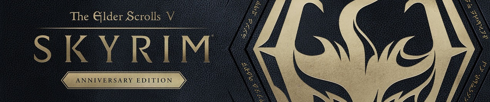
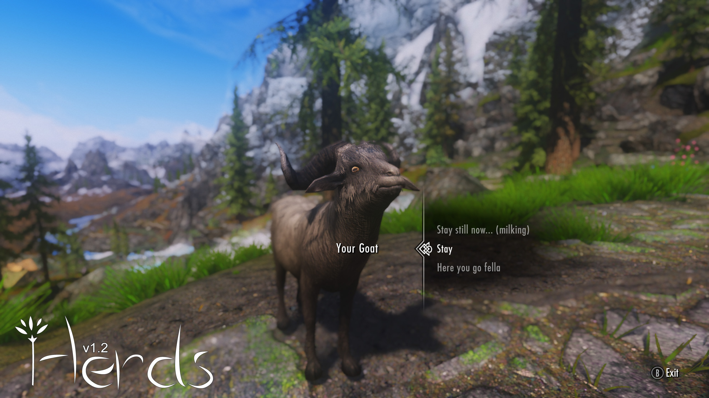

# Skyrim Resurrected 2023 modlist by Jaume Alcazo (WIP)

My modlist compilation for Skyrim AE, thanks to all the authors! I plan on doing a [collection](https://next.nexusmods.com/) on [Nexusmods](https://www.nexusmods.com/skyrimspecialedition) with this modlist. Feel free to use the "Adult (NSFW)" section or not, please. Contact me at jaume.alcazo@gmail.com



# Essential (many mods need these)

| Mod | Brief explanation | Spanish translation |
|----------|----------|----------|
| Skyrim Script Extender (SKSE64). (be sure to check if you install the version for [Steam](https://store.steampowered.com/sub/626153/) or for [GOG](https://www.gog.com/en/game/the_elder_scrolls_v_skyrim_anniversary_edition)!). | Essential. A lot of good mods use this as a base. | Para evitar que SKSE64 de Vortex Nexusmods **CAMBIE EL IDIOMA A ENGLISH** hay que primero [instalarlo de Vortex](https://www.nexusmods.com/skyrimspecialedition/mods/30379?tab=files) y luego bajarlo e instalarlo manualmente de [AQUÍ](https://skse.silverlock.org/) (comprobado 10/11/23). |
| [Address Library for SKSE Plugins.](https://www.nexusmods.com/skyrimspecialedition/mods/32444) | Be sure to pick Anniversary Edition AE or Special Edition SE! | Not needed. |
| [Unofficial Skyrim Special Edition Patch - USSEP.](https://www.nexusmods.com/skyrimspecialedition/mods/266) | Corrects a lot of bugs. | [USSEP Spanish con Voces](https://www.nexusmods.com/skyrimspecialedition/mods/5334?tab=files) (actualizado 6 julio 2023). |
| [Alternate Start - Live Another Life - SSE.](https://www.nexusmods.com/skyrimspecialedition/mods/272) | Alternative starts, skip the standard vanilla or do it, as you wish. | [Alternate Start - Live Another Life - Castellano con voces - Spanish](https://www.nexusmods.com/skyrimspecialedition/mods/65264?tab=files) (actualizado 24 junio 2023). |
| [Spell Perk Item Distributor (SPID).](https://www.nexusmods.com/skyrimspecialedition/mods/36869) | SKSE plugin that is used add spells/perks/items/shouts, etc. to the NPCs. | Not needed. |
| [CBBE Body.](https://www.nexusmods.com/skyrimspecialedition/mods/198) | Nice body, UNP alternative gives nudes when looting females (not males), and it's kinda gross. | [CBBE - Castellano - Spanish](https://www.nexusmods.com/skyrimspecialedition/mods/64240?tab=files) (updated 14 aug 2023). |
| [Achievements Mods Enabler.](https://www.nexusmods.com/skyrimspecialedition/mods/245) (Enables achievements in Skyrim SE/AE with mods. SKSE64 support). | Obviously we want our Steam achievements back!<br>  | Not needed. Furthermore: You don't need his DLL loader if you are using SKSE64 (which you should!). |
| [powerofthree's Papyrus Extender.](https://www.nexusmods.com/skyrimspecialedition/mods/22854) | SKSE64 plugin that extends Papyrus script functionality, with over 275 new Papyrus functions, and 29 events. | Not needed. |
| [Inventory Functions SE-AE.](https://www.nexusmods.com/skyrimspecialedition/mods/13366) | Allow mods filtering the inventory by keyword. | Not needed. |
| [Keyword Item Distributor (KID).](https://www.nexusmods.com/skyrimspecialedition/mods/55728) | Distributes keywords to weapons/armor/magic effects/ingestibles,etc..  | Not needed. |
| [MergeMapper.](https://www.nexusmods.com/skyrimspecialedition/mods/74689) | Allows Papyrus scripts to be aware and also allows other DLLs to support zmerge merges.  | Not needed. |
| [Inventory Interface Information Injector.](https://www.nexusmods.com/skyrimspecialedition/mods/85702) | Inserts interesting information, including item icons, into inventory interface. | [Inventory Interface Information Injector - Castellano - Spanish.](https://www.nexusmods.com/skyrimspecialedition/mods/94916) |
| [PapyrusUtil SE - Modders Scripting Utility Functions.](https://www.nexusmods.com/skyrimspecialedition/mods/13048) | Adds several new scripts with native functions that provide various conveniences related to data storage and other misc functions to the scripter/modder.  | Not needed. |

# Fixes / helpers

| Mod | Brief explanation | Spanish translation |
|----------|----------|----------|
| [Face Discoloration Fix.](https://www.nexusmods.com/skyrimspecialedition/mods/42441) | Eliminates the dreaded "dark face" issue that occurs when the game encounters FaceGen errors. | Not needed. |
| [Assorted mesh fixes.](https://www.nexusmods.com/skyrimspecialedition/mods/32117) | Fixes various issues with vanilla Skyrim meshes that causes them to render incorrectly. | Not needed. |
| [Actor Limit Fix.](https://www.nexusmods.com/skyrimspecialedition/mods/32349) | Increases the number of actors that can move, make facial expressions, and have their lips synced to their voice lines at any given time. | Not needed. |
| [Scrambled Bugs.](https://www.nexusmods.com/skyrimspecialedition/mods/43532) | A collection of engine bug fixes and patches. | Not needed. |
| [MCM Helper](https://www.nexusmods.com/skyrimspecialedition/mods/53000) | Simplifies the creation of Mod Configuration Menus. | Not needed. |
| [Mfg Fix.](https://www.nexusmods.com/skyrimspecialedition/mods/11669) | Fixes "mfg" console command and adds some more fixes. | Not needed. |
| [SSE Engine Fixes (skse64 plugin).](https://www.nexusmods.com/skyrimspecialedition/mods/17230) (part 1 by vortex, part 2 MANUAL INSTALLATION) | Fixes various issues with the Skyrim SE (and AE) engine. | Not needed. Remember that part2: **"Download this and extract it to your main Skyrim folder manually; it cannot be installed with a mod manager.** This is required or the SKSE64 plugin won't load.". In my experience, SSE Engine Fixes fixed an error with the races description in one of my modded modlists. |
| [Aurora Fix.](https://www.nexusmods.com/skyrimspecialedition/mods/77834) | SKSE plugin which fixes auroras getting stuck when transitioning between world spaces. | Not needed. |
| [WIDeadBodyCleanupScript Crash Fix.](https://www.nexusmods.com/skyrimspecialedition/mods/62413) | Fixes a rare crash when saving due to wideadbodycleanupscript. | Not needed. |
| [CritterSpawn Congestion Fix.](https://www.nexusmods.com/skyrimspecialedition/mods/67276) | A fix for the bug spawner, clogging your script engine, causing stacks to be dumped and bugs to be spawned. | Not needed. |
| [NPC AI Process Position Fix - NG.](https://www.nexusmods.com/skyrimspecialedition/mods/69326) | Skyrim's engine has a limitation where it can only update an NPC’s AI process position for one hour at most if that NPC is loaded in currently loaded cells (a high AI Process one). | Not needed. |
| [High Gate Ruins Puzzle Reset Fix.](https://www.nexusmods.com/skyrimspecialedition/mods/53643) | Fixes High Gate Ruins puzzle not resetting properly, blocking off half the dungeon on subsequent visits. | Not needed. |
| [Papyrus Tweaks NG](https://www.nexusmods.com/skyrimspecialedition/mods/77779) | Collection of fixes, tweaks, and performance improvements for Skyrim's script engine. 100% configurable. Install/Uninstall anytime. | Not needed. |

# GUI

| Mod | Brief explanation | Spanish translation |
|----------|----------|----------|
| [SkyUI.](https://www.nexusmods.com/skyrimspecialedition/mods/12604) | Elegant, PC-friendly interface mod with many advanced features. | Not needed. Gives problems (Jaume 14/11/23). |
| [Quick Loot RE.](https://www.nexusmods.com/skyrimspecialedition/mods/21085) | Adds a looting menu akin to the one present in Fallout 4. | Not needed. |
| [SkyUI-Style Quick Loot RE and EE Retexture.](https://www.nexusmods.com/skyrimspecialedition/mods/51017) | Retexture of Quick Loot to match SkyUI's colour scheme. | Not needed. |
| [TrueHUD - HUD Additions.](https://www.nexusmods.com/skyrimspecialedition/mods/62775) | Impressive HUD: <br>  | [TrueHUD - HUD Additions - Spanish - Castellano - Español.](https://www.nexusmods.com/skyrimspecialedition/mods/93935) |
| [The Elder Scrolls Legends - Loading Screens.](https://www.nexusmods.com/skyrimspecialedition/mods/37929) | 110 high quality and lore friendly artworks for loading screens. | [The Elder Scrolls Legends - Loading Screens - Spanish Translation.](https://www.nexusmods.com/skyrimspecialedition/mods/89506) |
| [Phenomenally Enriched and Nuanced Ingredients for SkyUI (P.E.N.I.S. for B.O.O.B.I.E.S.).](https://www.nexusmods.com/skyrimspecialedition/mods/90526) | Icons and colors for alchemical ingredients. | Not needed. |
| [Aura's Scrumptious Supplement (A.S.S. for B.O.O.B.I.E.S.).](https://www.nexusmods.com/skyrimspecialedition/mods/89823) | Icons and colors for food and other ingestible items. | Not needed. |

- Tested and discarded:
  -	Morehud. TRUEHUD IS 1000 TIMES BETTER!!!! (11/11/23 Jaume).

# Meshes

| Mod |  Brief explanation | Spanish translation |
|----------|----------|----------|
| [Dwemer Pipework Reworked](https://www.nexusmods.com/skyrimspecialedition/mods/46507) | See screenshots below. | Not needed. |
| [Thrones of Skyrim.](https://www.nexusmods.com/skyrimspecialedition/mods/41198) | See screenshots below. | Not needed. |
| [Better Blended Mushrooms.](https://www.nexusmods.com/skyrimspecialedition/mods/67725) | See screenshots below. | [Better Blended Mushrooms SPANISH by Jaume.](https://www.nexusmods.com/skyrimspecialedition/mods/104808) |
| [Renthal's waterwheel HD.](https://www.nexusmods.com/skyrimspecialedition/mods/26567) | See screenshots below. | Not needed. |
| [Night Mother.](https://www.nexusmods.com/skyrimspecialedition/mods/83527) | See screenshots below. | Not needed. |
| [JS Purses and Septims SE.](https://www.nexusmods.com/skyrimspecialedition/mods/37306) | See screenshots below. | [JS Purses and Septims SE - Latino.](https://www.nexusmods.com/skyrimspecialedition/mods/71667) |

<details><summary>Screenshots examples of the meshes </summary>           </details>

# Magic / Spells

| Mod | Spanish translation |
|----------|----------|
| [Apocalypse - Magic of Skyrim.](https://www.nexusmods.com/skyrimspecialedition/mods/1090) | [Apocalypse - Magic of Skyrim SPANISH TRANSLATION.](https://www.nexusmods.com/skyrimspecialedition/mods/29642) |

review of apocalypse

# Survival

| [Campfire - Complete Camping System.](https://www.nexusmods.com/skyrimspecialedition/mods/667) | [Campfire - Complete Camping System - Castellano - Spanish.](https://www.nexusmods.com/skyrimspecialedition/mods/1676) |

# Combat

| Mod | Spanish translation |
|----------|----------|
| [Valhalla Combat.](https://www.nexusmods.com/skyrimspecialedition/mods/64741) | Not needed. |
| [Locational Damage(SKSE Plugin).](https://www.nexusmods.com/skyrimspecialedition/mods/46932) | Not needed. ((This mod makes it possible to do extra damage and stagger etc. effect depending on the body part when the attack hits the actor. No ESP file.) |
| | [Loading Screen Truce AE.](https://www.nexusmods.com/skyrimspecialedition/mods/104522) Disables NPC combat AI temporarily during the loading screen. | Not needed. Furthermore: "Original mod is not required." 
| [Dynamic Impact - Slash Effects X.](https://www.nexusmods.com/skyrimspecialedition/mods/86071) | Not needed. |

# Immersion / Misc

| Mod | Brief explanation | Spanish translation |
|----------|----------|----------|
| [Wet and Cold SE.](https://www.nexusmods.com/skyrimspecialedition/mods/644/) | todo | [Wet and Cold - Castellano - Spanish.](https://www.nexusmods.com/skyrimspecialedition/mods/1448) |
| [Security Overhaul SKSE - Lock Variations.](https://www.nexusmods.com/skyrimspecialedition/mods/58224) | todo | Not needed. |
| [Security Overhaul SKSE - Regional Locks.](https://www.nexusmods.com/skyrimspecialedition/mods/62781) | todo | Not needed. |
| [Hunters Not Bandits. (ESL)](https://www.nexusmods.com/skyrimspecialedition/mods/1547) | (NPC's will not use taunts or insults when fighting animals. Especially hunters will behave in a more realistic manner, as well as fixing odd behaviors where enemies wish you a good morning and other unfitting dialogues right after they killed you.) | [Hunters Not Bandits Spanish.](https://www.nexusmods.com/skyrimspecialedition/mods/6028)

:tv: [Video review of Wintersun.](https://www.youtube.com/watch?v=g8G7jAr9mY8)

# Towns / Cities / Places / Villages

| Mod | Spanish translation |
|----------|----------|
| [Fortified Whiterun.](https://www.nexusmods.com/skyrimspecialedition/mods/40094) | [Fortified Whiterun - Spanish Translation.](https://www.nexusmods.com/skyrimspecialedition/mods/48142) |
| [JK's Solitude Outskirts (flagged ESL).](https://www.nexusmods.com/skyrimspecialedition/mods/103209) | [JK's Solitude Outskirts - Spanish Translation.](https://www.nexusmods.com/skyrimspecialedition/mods/104038) |
| [The Great Town of Ivarstead SSE.](https://www.nexusmods.com/skyrimspecialedition/mods/34505) | [The Great Town of Ivarstead SSE - Spanish Translation.](https://www.nexusmods.com/skyrimspecialedition/mods/41344) |
| [The Great Town of Karthwasten SSE.](https://www.nexusmods.com/skyrimspecialedition/mods/33032) | [The Great Town of Karthwasten SSE - Spanish Translation.](https://www.nexusmods.com/skyrimspecialedition/mods/41399) |

# Lighting

| Mod | Spanish translation |
|----------|----------|
| [Enhanced Lights and FX.](https://www.nexusmods.com/skyrimspecialedition/mods/2424) | (indispensable in Skyrim, in Fallout 4 no). |

# Landscape

| Mod | Brief explanation | Spanish translation |
|----------|----------|----------|
| [Majestic Mountains.](https://www.nexusmods.com/skyrimspecialedition/mods/11052) | todo | Not needed. |
| [Majestic Mountains - More Accurate Collisions.](https://www.nexusmods.com/skyrimspecialedition/mods/65042) | todo | Not needed. |
| [Skyrim 3D Rocks.](https://www.nexusmods.com/skyrimspecialedition/mods/17732) | todo | Not needed. |
| [Dynamic Distant Objects LOD - DynDOLOD](https://www.nexusmods.com/skyrimspecialedition/mods/32382) (required by Majestic mountains!) | todo | Not needed. |
| [The Marshlands.](https://www.nexusmods.com/skyrimspecialedition/mods/23062) | todo | Not needed. |
| [Immersive Shortcuts of Skyrim SE AE.](https://www.nexusmods.com/skyrimspecialedition/mods/104702) | todo | Not needed. |
| [Natural Waterfalls - Dragonborn.](https://www.nexusmods.com/skyrimspecialedition/mods/103170) | Natural Waterfalls. Now on Solstheim. | [Natural Waterfalls - Dragonborn - Castellano - Spanish.](https://www.nexusmods.com/skyrimspecialedition/mods/104871) |

# Monsters / Creatures

| Mod | Brief explanation | Spanish translation |
|----------|----------|----------|
| [Bogmort - Mud Monsters of Morthal Swamp.](https://www.nexusmods.com/skyrimspecialedition/mods/22447) | [Bogmort - Mud Monsters of Morthal Swamp - Spanish Translation.](https://www.nexusmods.com/skyrimspecialedition/mods/70060) |
| [Giants Overhaul- Mihail Monsters and Animals (SE-AE version).](https://www.nexusmods.com/skyrimspecialedition/mods/98581) | ``` TO BE DONE 🚧 ``` |
| [Sea Giants and Ice Titans- Mihail Monsters and Animals (SE-AE version).](https://www.nexusmods.com/skyrimspecialedition/mods/103285) | ``` TO BE DONE 🚧 ``` |
| [Bone Colossus- Mihail Monsters and Animals (SE-AE version) (''undead'').](https://www.nexusmods.com/skyrimspecialedition/mods/24521) | [Bone Colossus- Mihail Monsters and Animals (SE-AE version) - Spanish Translation.](https://www.nexusmods.com/skyrimspecialedition/mods/42742) ]
| [Falmer Overhaul - New models and textures.](https://www.nexusmods.com/skyrimspecialedition/mods/86338) | Not needed. |
| [Absolute Arachnophobia.](https://www.nexusmods.com/skyrimspecialedition/mods/24058) | Replaces the vanilla Frostbite Spider skeleton with a custom skeleton, transforming the Spiders into Arachnophobic nightmares! No ESP. | Not needed. |
| [Draugr Warhounds - Deadly Draugr Companions.](https://www.nexusmods.com/skyrimspecialedition/mods/82350) | todo | todo |

<details><summary>Screenshots (Bogmort). </summary>   </details>

# Weather / fog / fogs / mists

| Mod | Spanish translation |
|----------|----------|
| [Cathedral Weathers and Seasons.](https://www.nexusmods.com/skyrimspecialedition/mods/24791) | [Cathedral Weathers and Seasons - Castellano - Spanish.](https://www.nexusmods.com/skyrimspecialedition/mods/86719) |
| [Morning Fogs SSE.](https://www.nexusmods.com/skyrimspecialedition/mods/21436) | Not needed. |
| [Volumetric Mists.](https://www.nexusmods.com/skyrimspecialedition/mods/29273) | Not needed. |

:tv: [Video review of Cathedral Weathers (comparison with other weathers)](https://www.youtube.com/watch?v=p_CMoTK-8bM)

# Horses

| Mod | Spanish translation |
|----------|----------|
| [Blaze Of Eventide.](https://www.nexusmods.com/skyrimspecialedition/mods/3178/) (unique horse). | ``` TO BE DONE 🚧 ``` |
| [Zim's Aenbyr Custom Horse.](https://www.nexusmods.com/skyrimspecialedition/mods/76722) (unique horse). | ``` TO BE DONE 🚧 ``` |
| [Aeonbarr - a Unique and Summonable Horse (CH-Friendly) For SE.](https://www.nexusmods.com/skyrimspecialedition/mods/38466) (unique horse). | ``` TO BE DONE 🚧 ``` |
| [Witcher Horse Expansion.](https://www.nexusmods.com/skyrimspecialedition/mods/72490) | ``` TO BE DONE 🚧 ``` |

<details><summary>Screenshots. </summary>      </details>

# NPC's

| Mod | Spanish translation |
|----------|----------|
| [Pandorable's NPCs (FEMALES, USSEP).](https://www.nexusmods.com/skyrimspecialedition/mods/19012) (A visual overhaul of 85 female NPCs). | [Pandorable's NPCs - Spanish Translation (FEMALES, USSEP).](https://www.nexusmods.com/skyrimspecialedition/mods/101061) |

<details><summary>Screenshots example (here you have Zaria and Aduri Sarethi). </summary>  </details>

| Mod | Spanish translation |
|----------|----------|
| [Pandorable's NPCs - males.](https://www.nexusmods.com/skyrimspecialedition/mods/42043) | FALTA |
| [Pandorable's NPCs - males 2.](https://www.nexusmods.com/skyrimspecialedition/mods/50617) (Another 60 lads). | [Pandorable's NPCs - males 2 - Spanish Translation.](https://www.nexusmods.com/skyrimspecialedition/mods/101485) |
| [Pandorable's NPCs - Dawnguard (USSEP).](https://www.nexusmods.com/skyrimspecialedition/mods/24135?tab=files) | [Pandorable's NPCs - Dawnguard - Spanish Translation (USSEP).](https://www.nexusmods.com/skyrimspecialedition/mods/101056?tab=files) | 
| [RS Children Overhaul.](https://www.nexusmods.com/skyrimspecialedition/mods/2650) | Spanish translation marked redundant by Vortex. |
| [Dibella's Blessing.](https://www.nexusmods.com/skyrimspecialedition/mods/82606) (Apparance overhaul for 233 female characters from Skyrim). | [Dibella's Blessing - Spanish Translation.](https://www.nexusmods.com/skyrimspecialedition/mods/83704?tab=files) |

<details><summary>Screenshots example for Dibella's Blessing (here you have Bothela, Eola, Hroki, Marise, Karliah and Voldsea) </summary>    </details>

| Mod | Spanish translation |
|----------|----------|
| [KS Hairdos SSE.](https://www.nexusmods.com/skyrimspecialedition/mods/6817) | Not needed. |
| [Guards Armor Replacer SSE.](https://www.nexusmods.com/skyrimspecialedition/mods/22671) | [Guards Armor Replacer SSE - Spanish Translation.](https://www.nexusmods.com/skyrimspecialedition/mods/31889) |

# Items

| Mod | Spanish translation |
|----------|----------|
| [The Elder Scrolls Online Imports.](https://www.nexusmods.com/skyrimspecialedition/mods/11729) | ``` TODO. TO BE DONE 🚧 ``` |

# Expansions / DLC sized expansions

| Mod | Spanish translation |
|----------|----------|
| [Skyrim Sewers 4.](https://www.nexusmods.com/skyrimspecialedition/mods/9320) | [Skyrim Sewers 4 - Spanish Translation by Zedox.](https://www.nexusmods.com/skyrimspecialedition/mods/100402 |
| [Beyond Skyrim - Bruma SE](https://www.nexusmods.com/skyrimspecialedition/mods/10917) | [Beyond Skyrim Bruma SPANISH (by Jaume y Rubenoky).](https://www.nexusmods.com/skyrimspecialedition/mods/14508?tab=files) | a | b |

# Flora

| Mod | Spanish translation |
|----------|----------|
| [Folkvangr - Grass and Landscape Overhaul.](https://www.nexusmods.com/skyrimspecialedition/mods/44899) | Not needed. |

<details><summary>Screenshots example for Folkvangr </summary>     </details>

# Animations (OAR replaces DAR and it's fully compatible with DAR animations)

| Mod | Spanish translation |
|----------|----------|
| [Open Animation Replacer (OAR).](https://www.nexusmods.com/skyrimspecialedition/mods/92109) (Full backwards compatibility with DAR). | Not needed. |
| [Animation Queue Fix.](https://www.nexusmods.com/skyrimspecialedition/mods/82395) (required by OAR). | Not needed. |
| [Paired Animation Improvements.](https://www.nexusmods.com/skyrimspecialedition/mods/99621) | Not needed. |
| [EVG Conditional Idles (DAR).](https://www.nexusmods.com/skyrimspecialedition/mods/34006) | [EVG Conditional Idles - Spanish.](https://www.nexusmods.com/skyrimspecialedition/mods/66859) |
| [Male Player Animations (DAR).](https://www.nexusmods.com/skyrimspecialedition/mods/89225) | Not needed. |
| [Female Player Animations (DAR).](https://www.nexusmods.com/skyrimspecialedition/mods/85073) | Not needed. |
| [Gesture Animation Remix (DAR).](https://www.nexusmods.com/skyrimspecialedition/mods/64420) | Not needed. ("Adds over 50 dialogue gesture animation variants according to NPCs personality, role in society and by armor type. Works with custom followers and NPC from mods as well as vanilla"). |
| [Conditional tavern cheering (DAR).](https://www.nexusmods.com/skyrimspecialedition/mods/63029) | Not needed. |
| [Dynamic Swimming (DAR).](https://www.nexusmods.com/skyrimspecialedition/mods/34853?tab=description) | Not needed. |
| [Lively Children Animations (DAR).](https://www.nexusmods.com/skyrimspecialedition/mods/67557) | Not needed. |
| [Draugr One-handed Animation (DAR).](https://www.nexusmods.com/skyrimspecialedition/mods/74685) | Not needed. |
| [Comprehensive First Person Animation Overhaul - CFPAO.](https://www.nexusmods.com/skyrimspecialedition/mods/87169) | Not needed. |
| [Customizable Faster Woodcutting Animation - OAR or DAR.](https://www.nexusmods.com/skyrimspecialedition/mods/73857) | Not needed. "Speeds up the wood chopping animation. 10%, 20%, 30%, 40%, 50%, 60%, 70%, 80%, 90% faster versions. Chopping sound is played in the correct frames.)" |
| [Dynamic Torch Idle Animations (OAR).](https://www.nexusmods.com/skyrimspecialedition/mods/103080) |  
| [Riding Animation Overhaul - RAO (OAR - DAR).](https://www.nexusmods.com/skyrimspecialedition/mods/102881) | Not needed. |
| [Dynamic Feminine Female Modesty Animations (OAR)](https://www.nexusmods.com/skyrimspecialedition/mods/104374) | todo | Not needed. |

:tv: [Video review of EVG Conditional Idles.](https://www.youtube.com/watch?v=XgtfmLYdNOk)

:tv: [Video of Draugr One-handed Animation (DAR).](https://www.youtube.com/watch?v=RxSSYnSiIbU)

# Hunting / fauna / wildlife

| [Animallica SE - Skyrim Wildlife Overhaul](https://www.nexusmods.com/skyrimspecialedition/mods/20456) | [Animallica SE - Skyrim Wildlife Overhaul Spanish.](https://www.nexusmods.com/skyrimspecialedition/mods/20590) |
| [Fluffworks (Fluffy Animals).](https://www.nexusmods.com/skyrimspecialedition/mods/56361) | Not needed. Better looking fur in animals. |
| [Fluffworks (Fluffy Animals) - Domestic Goat with Bell.](https://www.nexusmods.com/skyrimspecialedition/mods/64744) | Not needed. |

# Map

| Mod | Spanish translation |
|----------|----------|
| [Flat World Map Framework (FWMF).](https://www.nexusmods.com/skyrimspecialedition/mods/29932) (This mod changes default 3D Skyrim map to a flat one). | Not needed. Framework for all below. |
| [Skyrim Paper Map by Caro Tuts for FWMF.](https://www.nexusmods.com/skyrimspecialedition/mods/62705?tab=files) | Not needed. |
| [Skuldafn Paper Map for FWMF.](https://www.nexusmods.com/skyrimspecialedition/mods/73489) | ``` TODO. TO BE DONE 🚧 ``` |
| [Beyond Skyrim Bruma Paper Map by Mirhayasu for FWMF.](https://www.nexusmods.com/skyrimspecialedition/mods/64037) | Not needed. |
| [Dayspring Canyon Paper Map for FWMF.](https://www.nexusmods.com/skyrimspecialedition/mods/61917) | ``` TODO. TO BE DONE 🚧 ``` |
| [Forgotten Vale Paper Map for FWMF.](https://www.nexusmods.com/skyrimspecialedition/mods/54628) | Not needed. |
| [Soul Cairn Paper Map for FWMF.](https://www.nexusmods.com/skyrimspecialedition/mods/55387) | ``` TODO. TO BE DONE 🚧 ``` |
| [Blackreach Paper Map for FWMF.](https://www.nexusmods.com/skyrimspecialedition/mods/53878?tab=files) | ``` TODO. TO BE DONE 🚧 ``` |

# Immersion

| Mod | Brief explanation | Spanish translation |
|----------|----------|----------|
| [Flying Crows SSE.](https://www.nexusmods.com/skyrimspecialedition/mods/49270) | a |
| [Nocturnal Moths.](https://www.nexusmods.com/skyrimspecialedition/mods/68288) | b |
| [Footprints.](https://www.nexusmods.com/skyrimspecialedition/mods/3808) | c |
| [Extended Encounters.](https://www.nexusmods.com/skyrimspecialedition/mods/44810) | d |
| [Immersive Death Cycle (ESL flagged).](https://www.nexusmods.com/skyrimspecialedition/mods/97048) (See dead animals decay over time, eventually turning into bones. Super lite and without any vanilla edits, needs SPID essential mod, already installed before in this modlist). | [Immersive Death Cycle - Castellano - Spanish](https://www.nexusmods.com/skyrimspecialedition/mods/97175) |
| [Fast Travel for Survival Mode.](https://www.nexusmods.com/skyrimspecialedition/mods/21067) | Not needed. |
| [Rich Skyrim Merchants.](https://www.nexusmods.com/skyrimspecialedition/mods/1772) | Not needed. |

# Base Object Swapper (BOS)


| Mod | Brief explanation | Spanish translation |
|----------|----------|----------|
| [Base Object Swapper.](https://www.nexusmods.com/skyrimspecialedition/mods/60805) (needs [powerofthree's Tweaks](https://www.nexusmods.com/skyrimspecialedition/mods/51073)). | Used by a lot of mods to swap some items in the world. | Not needed. |
| [Destructible Skyrim - Base Object Swapper.](https://www.nexusmods.com/skyrimspecialedition/mods/77568) | "Smash, shout, and blow up the environment around you, without the need for silly, complicated patches! Be careful, though - just like with stealing, people aren't very fond of the destruction of their property!" | [Destructible Skyrim - Base Object Swapper SPANISH by Jaume.](https://www.nexusmods.com/skyrimspecialedition/mods/104800) |
| [Hawk Patch - Base Object Swapper Remake.](https://www.nexusmods.com/skyrimspecialedition/mods/71546?tab=description) | Makes all hawks that can't be shot shootable instead. | Not needed. |
| [Creation Club Basket Distribution - Base Object Swapper (BOS)](https://www.nexusmods.com/skyrimspecialedition/mods/74577) | Integrates the baskets from Bloodchill Manor, Hendraheim, Myrwatch Tower, Shadowfoot Sanctum and Tundra Homestead to Skyrim holds. Also includes additional baskets to cover the variations that doesn't exist in the original Cleation Club plugins. | Not needed. |
| Bruma Clutter for Skyrim Imperials - Base Object Swapper (BOS).](https://www.nexusmods.com/skyrimspecialedition/mods/74178) | "Beyond Skyrim Bruma includes many imperial themed items that you can't find in Skyrim without an integration patch. This mod replaces many items from Skyrim for their Bruma counterparts only in imperial houses. Now you can feel like imperials have their own culture and that they're not just smaller nords." | Not needed. |

# Interiors

| Mod | Brief explanation | Spanish translation |
|----------|----------|----------|
| JK's Belethor's General Goods. DON'T INSTALL THE ENGLISH! | Just the spanish one, or the name of the door will be overriden! | [JK's Belethor's General Goods - Spanish Translation.](https://www.nexusmods.com/skyrimspecialedition/mods/37339) |
| [JK's Dragonsreach.](https://www.nexusmods.com/skyrimspecialedition/mods/34000) | Famous palace in Whiterun. | [JK's Dragonsreach - Spanish Translation.](https://www.nexusmods.com/skyrimspecialedition/mods/37336) |
| [JK's Warmaiden's.](https://www.nexusmods.com/skyrimspecialedition/mods/33685) | Famous shop in Whiterun. | [JK's Warmaiden's - Spanish Translation.](https://www.nexusmods.com/skyrimspecialedition/mods/37364) |
| [Snazzy Interiors - Vittoria Vici's House.](https://www.nexusmods.com/skyrimspecialedition/mods/100475) | Complete overhaul of Vittoria Vici's house in Solitude. ESL flagged. | [Snazzy Interiors - Vittoria Vici's House - Spanish Translation.](https://www.nexusmods.com/skyrimspecialedition/mods/102908) |

# Audio / SFX

| Mod | Brief explanation | Spanish translation |
|----------|----------|----------|
| [Celtic Music in Skyrim - SE.](https://www.nexusmods.com/skyrimspecialedition/mods/2980?tab=files) | todo | Not needed. |
| [Bow Before The Dead - Draugr Sounds- (ENIGMA REMASTER).](https://www.nexusmods.com/skyrimspecialedition/mods/46500) | todo | Not needed. |

# Character creation / presets / roleplaying / RPG

| Mod | Brief explanation | Spanish translation |
|----------|----------|----------|
| [Better Male Presets.](https://www.nexusmods.com/skyrimspecialedition/mods/2001) | Not needed. GOOD looking vanilla default presets replacer! | 
| [Imperious - Races of Skyrim.](https://www.nexusmods.com/skyrimspecialedition/mods/1315) | [Imperious - Races of Skyrim Spanish.](https://www.nexusmods.com/skyrimspecialedition/mods/4893) |
| [Xenius Character Enhancement Complete.](https://www.nexusmods.com/skyrimspecialedition/mods/36985) | Not needed. |
| [Ordinator perks for NPCs.](https://www.nexusmods.com/skyrimspecialedition/mods/42022) | todo | Not needed. |
| [Ordinator - Perks of Skyrim.](https://www.nexusmods.com/skyrimspecialedition/mods/1137) | todo | [Ordinator - Perks of Skyrim SPANISH TRANSLATION.](https://www.nexusmods.com/skyrimspecialedition/mods/30246) |
| [Reflection - Level Up Messages.](https://www.nexusmods.com/skyrimspecialedition/mods/1188) | todo | [Reflection - Level Up Messages Spanish Translation.](https://www.nexusmods.com/skyrimspecialedition/mods/58831) |
| [Wintersun - Faiths of Skyrim.](https://www.nexusmods.com/skyrimspecialedition/mods/22506) | todo | [Wintersun - Faiths of Skyrim Spanish.](https://www.nexusmods.com/skyrimspecialedition/mods/22563) |

# Textures

| Mod | Brief explanation | Spanish translation |
|----------|----------|----------|
| [Iconic's Spiders of Skyrim Retexture.](https://www.nexusmods.com/skyrimspecialedition/mods/89960) | todo | Not needed. |
| [Deathbell HD - All-New Textures (2K-1K).](https://www.nexusmods.com/skyrimspecialedition/mods/10755) | todo |Not needed. |
| [Better Chests.](https://www.nexusmods.com/skyrimspecialedition/mods/71680) | todo | Not needed. |
| [Whiterun Doors and Gate 2K.](Mesh improvements and retexture of vanilla Whiterun doors and main gate - no ESP.) | todo | Not needed. |
| [Enhanced Blood Textures.](https://www.nexusmods.com/skyrimspecialedition/mods/2357) | Esstential! | Not needed. |
| [Better Dwemer Spider Textures.](https://www.nexusmods.com/skyrimspecialedition/mods/3049) | todo | Not needed. |

# Forts

| Mod | Spanish translation |
|----------|----------|
| [Nirvana's Fort Greymoor (ESL flagged).](https://www.nexusmods.com/skyrimspecialedition/mods/89380) | Not needed. |
| [Fortified and Animated Fort Doors SE.](New door meshes and textures with custom animations and matching sounds for all the forts in Skyrim.) | Not needed. |

# Parallax textures

| Mod | Spanish translation |
|----------|----------|
| [The Omnibus - Terrain Complex Parallax AiO.](https://www.nexusmods.com/skyrimspecialedition/mods/83011) | Not needed. |

# Dungeons

| Mod | Spanish translation |
|----------|----------|
| [Unique Vampire Dens SSE.](https://www.nexusmods.com/skyrimspecialedition/mods/14762) (Adds six new, unique, hidden vampire dens in various cities around the world). | [Unique Vampire Dens SSE - Spanish Translation.](https://www.nexusmods.com/skyrimspecialedition/mods/43686) |

# Grim and Gore

| Mod | Spanish translation |
|----------|----------|
| [Gallows of Skyrim SSE.](https://www.nexusmods.com/skyrimspecialedition/mods/26542) | [Gallows of Skyrim SSE - Spanish Translation.](https://www.nexusmods.com/skyrimspecialedition/mods/37513) |
| [Skyrim Battle Aftermath SE.](https://www.nexusmods.com/skyrimspecialedition/mods/4742) | [Skyrim Battle Aftermath SE - Spanish Translation.](https://www.nexusmods.com/skyrimspecialedition/mods/50628) |

<details><summary>Screenshots. </summary>  </details>

# Towers and Ruins

| Mod | Spanish translation |
|----------|----------|
| [Ryn's Broken Tower Redoubt.](https://www.nexusmods.com/skyrimspecialedition/mods/102141) (Flagged as ESL). | [Ryn's Broken Tower Redoubt - Spanish Translation](https://www.nexusmods.com/skyrimspecialedition/mods/102797) |
| [Nordic Ruins of Skyrim SSE.](https://www.nexusmods.com/skyrimspecialedition/mods/20382) |  ``` TODO. TO BE DONE 🚧 ``` |
| [Tactical Valtheim.](https://www.nexusmods.com/skyrimspecialedition/mods/9101) | [Tactical Valtheim SSE - Spanish Translation.](https://www.nexusmods.com/skyrimspecialedition/mods/42326) |

# Shrines and statues

| Mod | Spanish translation |
|----------|----------|
| [Ryn's Azura's Shrine (Flagged as ESL).](https://www.nexusmods.com/skyrimspecialedition/mods/86592) (A large overhaul of the Azura's Shrine area and a new dungeon) | [Ryn's Azura's Shrine - Spanish Translation.](https://www.nexusmods.com/skyrimspecialedition/mods/88621) |

<details><summary>Screenshots. </summary>  </details>

# Collectibles

| Mod | Spanish translation |
|----------|----------|
| [Additional Hearthfire Dolls.](https://www.nexusmods.com/skyrimspecialedition/mods/46930) (Adds 41 collectible special variants of the Hearthfire doll). | [Additional Hearthfire Dolls SPANISH.](https://www.nexusmods.com/skyrimspecialedition/mods/47410) |
| [Skyrims Unique Treasures.](https://www.nexusmods.com/skyrimspecialedition/mods/5261) | [Skyrim Unique Treasures SPANISH.](https://www.nexusmods.com/skyrimspecialedition/mods/48368) |
| [New Treasure Hunt SSE.](https://www.nexusmods.com/skyrimspecialedition/mods/19469) ((Adds 13 new hand-drawn treasure maps and treasures hidden across Skyrim SE.) | [New Treasure Hunt SSE. - Spanish Translation.](https://www.nexusmods.com/skyrimspecialedition/mods/85024) |
| [Each Stone of Barenziah Gives You a Bonus (ESLified).](https://www.nexusmods.com/skyrimspecialedition/mods/37122) | Not needed. |

<details><summary>Screenshots. </summary>        </details>

 ``` FINS AQUÍ INSTAL·LAT 🚧 ```

  - [Daedric Shrines - All in One.](https://www.nexusmods.com/skyrimspecialedition/mods/78772)


# Animals
  - [Herds SSE.](https://www.nexusmods.com/skyrimspecialedition/mods/13880)


# GUI
  - [SkyUI.](https://www.nexusmods.com/skyrimspecialedition/mods/12604?tab=files)

# Fixes
  - [SSE Engine Fixes (skse64 plugin).](https://www.nexusmods.com/skyrimspecialedition/mods/17230)
  - [Bug Fixes SSE.](https://www.nexusmods.com/skyrimspecialedition/mods/33261)
  - [SSE FPS Stabilizer.](https://www.nexusmods.com/skyrimspecialedition/mods/38438)

# Meshes / Models

  - [JS Shrines of the Divines SE.](https://www.nexusmods.com/skyrimspecialedition/mods/33394)
  - [Additional Dremora faces.](https://www.nexusmods.com/skyrimspecialedition/mods/97946)

# Weather
  - [Volumetric Mists.](https://www.nexusmods.com/skyrimspecialedition/mods/29273)
  - [Obsidian Weathers and Seasons.](https://www.nexusmods.com/skyrimspecialedition/mods/12125)

# Towns and Cities
  - [Fortified Whiterun.](https://www.nexusmods.com/skyrimspecialedition/mods/40094)

# Sea and Water
  - [Depths of Skyrim - An Underwater Overhaul SSE.](https://www.nexusmods.com/skyrimspecialedition/mods/26913)

# Dungeons
  - [Dungeons - Revisited](https://www.nexusmods.com/skyrimspecialedition/mods/51798)

# Adult (NSFW)
  - [PsBoss's Statuettes](https://www.nexusmods.com/skyrimspecialedition/mods/66550)

  - [Caliente's Beautiful Bodies Enhancer -CBBE-](https://www.nexusmods.com/skyrimspecialedition/mods/198)
  - 

# Spanish translations (if you want to play it with spanish texts & voices):

    - [Herds SSE Spanish.](https://www.nexusmods.com/skyrimspecialedition/mods/13980)
  - [Unofficial Skyrim Special Edition Patch - Castellano con voces - Spanish.](https://www.nexusmods.com/skyrimspecialedition/mods/73323)
  
